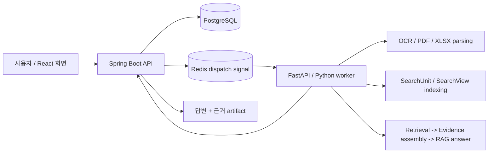

<!-- v5_0_summary_start -->
## Current RAG Diagnostic Status
Current RAG status: `V5_0_V4_CLOSEOUT_AND_V5_GATE_PLAN_DIAGNOSTIC_NONPROD_READY`.
`current` resolves to `v5_0`: diagnostic-only v4 closeout and v5 gate planning. `v4_7_18` remains the frozen v4 closeout basis at `v4_7_18_xlsx_candidate_only_materialization_repair_and_lineage_reproducibility` and remains directly checkable. v4 is closed as diagnostic-only source-first/candidate-only/lineage-reproducibility work, not as official evaluation. TEXT 232/350 hit, PDF 265/325 hit, XLSX 26/325 hit; XLSX residual backlog remains 299 misses, 78 zero-candidate rows, and 109 budget-exhausted rows.
Hard boundary: diagnostic-only, non-production, not official metric, not gold/qrels/labels, not denominator, not training/fine-tuning/FT-A, not promotion evidence, not product-success evidence, and not live readiness. Official opening still requires gold/qrels/expected-evidence/relevance/answerability/denominator/promotion decisions. official_metric_input_rows=0, fine_tuning_executed=false, and protected_namespaces_touched=[].
Canonical rolling docs remain `docs/rag-ingestion-progress.md`, `docs/rag-ingestion-measurements.md`, and `docs/rag-ingestion-triage.md`; production promotion remains closed. Historical compatibility breadcrumbs retained for lower-section status-sync context, not current handoff: v4_7 remains pre-official; prior v4_7 cleanup keys remain explicit; supersedes the abstract v4_7_1 Korean review packet with hydrated rows 204, PDF 100, XLSX 104; v4_7_2 supersedes the abstract v4_7_1 packet with non-empty `질의문` 204 in `review_packet_ko_hydrated.xlsx`; `## Korean human review packet`; The previous v4_7_1 Korean review packet was abstract; actual Korean query candidates; User-owned fields remain blank/default; v4_7_3 applies the user-reviewed Korean query candidate CSV and v4_7_3 applies the user-reviewed CSV decisions (`미검수=통과`), not official metric and not gold/qrels; PDF survivor 58 and v4_7_4 replays only the 58 user-passed PDF survivor candidates.
<!-- v5_0_summary_end -->

## 프로젝트 개요

| 항목 | 내용 |
|---|---|
| 프로젝트 성격 | 문서 검색·질의응답 AI 파이프라인 |
| 처리 문서 | TEXT, PDF, XLSX |
| 핵심 기능 | 문서 파싱, OCR, 검색 인덱싱, RAG 답변 생성, citation 표시 |
| 주요 기술 | Spring Boot, FastAPI, Python, PostgreSQL, Redis, FAISS, React/Vite |
| 구현 방향 | 긴 AI 작업은 비동기 job으로 처리하고, 답변의 원문 근거는 추적 가능한 evidence 구조로 관리 |

## 핵심 목표

AI 문서 검색에서 중요한 것은 답변의 자연스러움만이 아닙니다.  
답변이 실제 문서의 어떤 부분을 근거로 생성되었는지 확인할 수 있어야 합니다.

이 프로젝트는 다음 목표를 기준으로 구현했습니다.

| 목표 | 설명 |
|---|---|
| 문서 유형별 처리 | PDF, XLSX, TEXT 문서를 각 형식에 맞게 파싱 |
| 검색 가능한 단위 구성 | 문서 내용을 검색과 답변 생성에 사용할 수 있는 단위로 정리 |
| 근거 기반 답변 생성 | 질문과 관련된 원문 근거를 찾고 이를 바탕으로 답변 생성 |
| citation 제공 | 답변에 사용된 PDF page, XLSX sheet/cell, TEXT chunk 정보를 함께 반환 |
| 비동기 작업 처리 | OCR, 인덱싱, RAG처럼 오래 걸리는 작업을 job pipeline으로 분리 |

## RAG 응답 품질 예시

아래 예시는 전체 성능 지표를 대체하기 위한 벤치마크가 아니라, 이 프로젝트가 문서 유형별로 어떤 질문을 처리하고 어떤 근거를 함께 반환하는지 보여주는 대표 샘플입니다.

각 응답은 단순 생성 결과가 아니라, 답변에 사용된 원문 위치를 함께 관리합니다.

### PDF 문서 질의

| 질문 | 응답 | 근거 | 확인 가능한 점 |
|---|---|---|---|
| 2020년 한국 원달러 기말 환율은 얼마인가요? | 2020년 한국 원달러 기말 환율은 1,088.0입니다. | 최근경제동향 PDF p.65 | PDF 표 안에서 특정 연도와 항목을 찾고 해당 값을 추출 |
| 2024년 수출입차 금액은 얼마인가요? | 2024년 수출입차 금액은 6,836.1입니다. | 최근경제동향 PDF p.61 | PDF 내 경제지표 표에서 질문 항목과 연도를 매칭 |

### XLSX 문서 질의

| 질문 | 응답 | 근거 | 확인 가능한 점 |
|---|---|---|---|
| 2019년 2월 5호선의 승차총승객수는 몇 명입니까? | 2019년 2월 5호선의 승차총승객수는 15,446,522명입니다. | 철도 sheet, D352 | 조건에 맞는 행을 찾고 특정 셀의 display value를 응답에 사용 |
| 2020년 11월에 지정된 하얀민들레노인요양원의 우편번호는 무엇입니까? | 2020년 11월에 지정된 하얀민들레노인요양원의 우편번호는 41786입니다. | 일반현황 sheet, C702 | 기관명과 지정일 조건을 만족하는 행에서 우편번호 셀을 추출 |
| 2014년 12월에 지정된 해뜨는요양원2의 시도 시군구 법정동명은 무엇입니까? | 해뜨는요양원2의 시도 시군구 법정동명은 대구광역시 북구 복현동입니다. | 일반현황 sheet, G752 | 여러 조건을 조합해 행을 찾고 행 내 다른 컬럼 값을 응답 |

### TEXT 문서 질의

| 질문 | 응답 | 근거 | 확인 가능한 점 |
|---|---|---|---|
| 미츠하는 타키를 만나려고 어디로 향했어 | 미츠하는 타키를 실제로 만나기 위해 도쿄로 향했습니다. | TEXT chunk/source context | 서술형 문맥에서 장소 정보를 찾아 자연어로 응답 |
| 유우야키의 나이와 생일은 어떻게 적혀 있어 | 유우야키의 나이는 16세이고 생일은 9월 29일입니다. | TEXT chunk/source context | 한 문맥 안의 여러 속성 값을 함께 추출 |

더 많은 샘플과 XLSX display-value/cell-range 진단 결과는 [Evaluation harness samples](ai/eval/README.md)에 정리했습니다.

## Citation 처리 방식

문서 유형마다 원문 근거를 표현하는 방식이 다르기 때문에, citation을 하나의 문자열로 단순화하지 않고 문서 유형별 evidence 구조로 분리했습니다.

| 문서 유형 | citation 단위 | 예시 |
|---|---|---|
| PDF | page, text/table context | `p.65`, `p.61` |
| XLSX | sheet, range, cell, display value | `철도!D352`, `일반현황!C702` |
| TEXT | chunk, source context | `chunk id`, `source excerpt` |

검색 단계에서 찾은 후보와 최종 답변에 사용된 근거는 분리해서 관리했습니다.

검색 후보는 관련 문서를 찾기 위한 retrieval candidate이고, citation은 사용자가 실제로 확인할 수 있어야 하는 원문 근거입니다.  
이 둘을 구분해 답변 생성 과정과 근거 표시 과정이 섞이지 않도록 했습니다.

| 개념 | 역할 |
|---|---|
| SearchUnit | 검색 인덱싱의 기본 단위 |
| SearchView | retrieval candidate 구성을 위한 검색 표현 |
| SourceAtom | 최종 citation에 사용되는 원문 근거 단위 |
| Evidence contract | PDF/XLSX/TEXT 유형별 근거 표현 규칙 |

## 시스템 흐름

사용자는 문서를 등록하거나 질문을 보냅니다.  
API 서버는 작업을 생성하고 상태를 관리하며, AI worker는 문서 파싱, 검색 인덱싱, 근거 조립, 답변 생성을 비동기로 수행합니다.

## 주요 기능

| 영역 | 구현 내용 |
|---|---|
| 문서 등록 및 작업 관리 | 문서 처리 job 생성, 상태 조회, 결과 artifact 조회 |
| 비동기 AI 처리 | Redis signal 기반 worker dispatch, callback delivery, job 상태 추적 |
| 문서 파싱 | TEXT chunking, PDF text/table 처리, XLSX workbook 구조 및 display value 추출 |
| 검색 인덱싱 | SearchUnit/SearchView 기반 검색 단위 구성, FAISS 기반 retrieval |
| RAG 답변 생성 | 검색 결과를 기반으로 답변 생성 및 citation artifact 구성 |
| 근거 추적 | PDF page, XLSX sheet/range/cell, TEXT chunk 단위의 evidence 관리 |
| 평가 도구 | answer/citation scorer, retrieval smoke metric, diagnostic-only 결과 관리 |
| 화면 구성 | React/Vite 기반 작업 목록, 상태 timeline, 결과 preview 화면 |

## 해결한 문제

### 1. 긴 AI 작업을 요청/응답 흐름에서 분리

OCR, 문서 파싱, 인덱싱, RAG 답변 생성은 처리 시간이 길고 실패 가능성도 있습니다.

이를 API 요청 안에서 직접 처리하지 않고, job pipeline으로 분리했습니다.  
Spring Boot API는 job 생성과 상태 관리를 담당하고, FastAPI worker는 실제 문서 처리와 RAG 작업을 수행합니다.

PostgreSQL은 job 상태와 결과 저장의 기준점으로 사용하고, Redis는 worker dispatch signal 용도로 제한했습니다.

### 2. 답변과 근거를 함께 검증할 수 있는 구조 구성

RAG 시스템에서 검색된 문서 조각이 항상 최종 답변의 직접 근거가 되는 것은 아닙니다.

이 프로젝트에서는 retrieval candidate와 citation evidence를 분리해, 최종 응답에 사용된 원문 위치를 별도로 관리했습니다.  
이를 통해 답변 생성에 사용되는 검색 흐름과 사용자가 검증할 수 있는 citation 흐름을 구분했습니다.

### 3. XLSX 셀 단위 근거 추적

XLSX 문서는 일반 텍스트처럼 chunk만 나누면 답변 근거를 확인하기 어렵습니다.

예를 들어 특정 기관명, 지정일, 노선명 같은 조건으로 행을 찾고, 그 행의 특정 컬럼 값을 답해야 하는 경우가 많습니다.  
따라서 sheet, range, cell, display value를 별도 evidence로 관리해 사용자가 응답에 사용된 값을 셀 단위로 확인할 수 있게 했습니다.

### 4. PDF 표 기반 질의 처리

PDF 문서에서는 본문 텍스트뿐 아니라 표 안의 값이 답변 근거가 되는 경우가 많습니다.

이 프로젝트에서는 PDF page citation을 유지하면서, 표나 경제지표처럼 행/열 맥락이 필요한 질문에 대해 관련 페이지와 값을 함께 추적하도록 구성했습니다.

### 5. 평가 결과와 운영 기준 분리

평가 harness에서 나온 결과를 곧바로 운영 품질처럼 단정하지 않도록 결과의 성격을 구분했습니다.

| 구분 | 의미 |
|---|---|
| diagnostic-only | 원인 분석과 개선 방향 확인용 결과 |
| promotion evidence | 인덱스나 정책 승격 판단에 사용할 수 있는 근거 |
| production promotion | 실제 운영 기준으로 반영된 상태 |

이를 통해 실험용 진단 결과, 승격 판단 근거, 실제 운영 기준이 섞이지 않도록 관리했습니다.

## 기술 스택

| 영역 | 기술 |
|---|---|
| Backend API | Spring Boot |
| AI Worker | FastAPI, Python |
| Database | PostgreSQL |
| Dispatch / Signal | Redis |
| Retrieval | FAISS |
| Frontend | React, Vite |
| Document Processing | PDF parsing, XLSX workbook extraction, OCR |
| Evaluation | answer/citation scorer, retrieval smoke metric |

## 폴더 구조

| 경로 | 역할 |
|---|---|
| [`core-api/`](core-api/) | Spring Boot API 서버 |
| [`ai/app/`](ai/app/) | Python AI worker와 capability 구현 |
| [`ai/eval/`](ai/eval/) | RAG/OCR evaluation harness와 기준 데이터 |
| [`frontend/app/`](frontend/app/) | React/Vite UI |
| [`docker-compose.yml`](docker-compose.yml) | 로컬 PostgreSQL, Redis, 선택형 MinIO/LLM 인프라 구성 |
| [`.env.example`](.env.example) | 로컬 실행 환경 변수 예시 |
| [`docs/THIRD_PARTY_DATA_LICENSES.md`](docs/THIRD_PARTY_DATA_LICENSES.md) | 외부 데이터 및 라이선스 고지 |

## 라이선스와 외부 데이터

이 저장소의 직접 작성 코드와 문서는 [Apache License 2.0](LICENSE)을 따릅니다.

단, 외부에서 수집한 PDF, XLSX, 이미지, OCR/MM annotation, 폰트, 공공데이터, Hugging Face dataset mirror, NamuWiki metadata 등은 이 저장소의 Apache-2.0 라이선스로 재허가되지 않습니다.

원천별 이용조건과 내부 diagnostic usage gate는 [Third-party data license notice](docs/THIRD_PARTY_DATA_LICENSES.md)를 확인하세요.