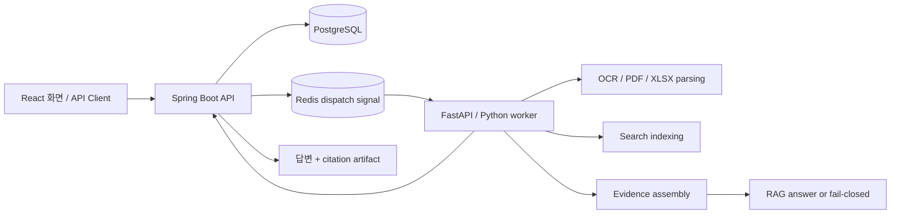

# 근거 검증형 문서 RAG 백엔드

TEXT, PDF, XLSX 문서를 대상으로 질문에 답하고, 답변에 사용된 원문 위치를
함께 남기는 문서 검색·질의응답 백엔드입니다.

이 프로젝트의 초점은 "그럴듯한 답변"보다 "확인 가능한 답변"입니다. 검색된
후보 문서 조각과 실제 답변 근거를 분리하고, 근거가 부족하거나 범위가
불명확한 요청은 답변을 만들지 않고 중단하도록 설계했습니다.

## 한눈에 보기

| 항목 | 내용 |
|---|---|
| 프로젝트 성격 | 비동기 문서 처리와 RAG 답변 생성을 포함한 AI 백엔드 |
| 처리 문서 | TEXT, PDF, XLSX |
| 핵심 기능 | 문서 파싱, OCR, 검색 인덱싱, 근거 조립, RAG 답변 생성, citation 추적 |
| 주요 기술 | Spring Boot, FastAPI, Python, PostgreSQL, Redis, Weaviate, FAISS, React/Vite |
| 구현 방향 | 오래 걸리는 AI 작업은 job pipeline으로 분리하고, 답변 근거는 추적 가능한 구조로 관리 |

## 문제의식

문서 RAG에서 어려운 부분은 답변을 생성하는 것만이 아닙니다. 사용자가
"이 답변이 실제 문서의 어디에서 나온 것인지" 확인할 수 있어야 합니다.

특히 XLSX나 PDF처럼 구조가 있는 문서는 단순 텍스트 chunk만으로 근거를
표현하기 어렵습니다. XLSX는 sheet, row, column, cell 단위가 중요하고,
PDF는 page와 표의 행·열 맥락이 함께 필요합니다.

이 프로젝트는 다음 기준으로 구현했습니다.

| 목표 | 구현 방향 |
|---|---|
| 문서 유형별 처리 | TEXT/PDF/XLSX를 각 형식에 맞게 파싱하고 검색 가능한 단위로 정리 |
| 근거 기반 답변 | 답변에 사용된 원문 위치를 `SourceAtom`(원문 위치 단위) / `EvidenceBundle`(답변 가능한 근거 묶음) 구조로 관리 |
| 후보와 근거 분리 | 검색 후보는 candidate로만 사용하고, 최종 citation은 별도 근거 구조에서 검증 |
| Fail-closed 정책 | 근거가 부족하거나 범위가 애매하면 답변을 추측하지 않고 중단 |
| 비동기 처리 | OCR, 인덱싱, RAG 실행을 API 요청 흐름에서 분리 |

## 현재 상태

포트폴리오 기준으로는 운영 배포나 공식 성능 지표를 주장하지 않고,
비생산 환경의 진단 결과와 trace를 통해 구현 경계를 보여주는 상태입니다.

| 영역 | 현재 기준 |
|---|---|
| 검색 백엔드 | Weaviate 기반 hybrid 검색을 기본 비생산 진단 경로로 사용 |
| 근거 표면 | `SourceAtom` / `EvidenceBundle`을 답변 근거의 기준 구조로 사용 |
| 로컬 비교 경로 | FAISS는 운영 VectorDB가 아니라 진단/비교용 기준선으로 유지 |
| 현재 검증 라인 | `current`는 `v6_9_answer_quality_gate_packet_nonprod` 기준으로 확인 |
| 응답 정책 확인 | 29개 승인 질의 중 PDF/TEXT 10개는 citation verified 답변, XLSX 19개는 fail-closed |
| 검색 후보 검수 | `v6_9_1_retrieval_smoke_pre_review_packet_nonprod`에서 135개 후보 row를 검수 패킷으로 분리 |
| 추적 계층 표현 | 자율 에이전트 플랫폼이 아니라, RAG 실행의 tool/policy/trace 경계를 얇게 감싼 진단 계층 |

위 수치는 답변 품질 점수나 제품 성과 지표가 아니라, 현재 구현이
어떤 조건에서 답변하고 어떤 조건에서 멈추는지 보여주는 진단 기준입니다.

## RAG 응답/근거 예시

아래 예시는 전체 성능 지표가 아니라, 문서 유형별로 어떤 근거를 함께
관리하는지 보여주는 대표 샘플입니다.

### PDF 문서 질의

| 질문 | 응답 | 근거 | 확인 가능한 점 |
|---|---|---|---|
| 2020년 한국 원달러 기말 환율은 얼마인가요? | 2020년 한국 원달러 기말 환율은 1,088.0입니다. | 최근경제동향 PDF p.65 | PDF 표 안에서 특정 연도와 항목을 찾아 값을 추출 |
| 2024년 수출입차 금액은 얼마인가요? | 2024년 수출입차 금액은 6,836.1입니다. | 최근경제동향 PDF p.61 | PDF 경제지표 표에서 질문 항목과 연도를 매칭 |

### XLSX 문서 질의

XLSX는 sheet/range/cell/display value를 함께 관리합니다. 아래 예시는 셀
단위 citation 구조를 설명하기 위한 샘플이며, XLSX 전체 성공률을 의미하지
않습니다.

| 질문 | 응답 | 근거 | 확인 가능한 점 |
|---|---|---|---|
| 2019년 2월 5호선의 승차총승객수는 몇 명입니까? | 2019년 2월 5호선의 승차총승객수는 15,446,522명입니다. | 철도 sheet, D352 | 조건에 맞는 행을 찾고 특정 셀의 display value를 응답에 사용 |
| 2020년 11월에 지정된 하얀민들레노인요양원의 우편번호는 무엇입니까? | 2020년 11월에 지정된 하얀민들레노인요양원의 우편번호는 41786입니다. | 일반현황 sheet, C702 | 기관명과 지정일 조건을 만족하는 행에서 우편번호 셀을 추출 |
| 2014년 12월에 지정된 해뜨는요양원2의 시도 시군구 법정동명은 무엇입니까? | 해뜨는요양원2의 시도 시군구 법정동명은 대구광역시 북구 복현동입니다. | 일반현황 sheet, G752 | 여러 조건을 조합해 행을 찾고 행 내 다른 컬럼 값을 응답 |

### TEXT 문서 질의

| 질문 | 응답 | 근거 | 확인 가능한 점 |
|---|---|---|---|
| 미츠하는 타키를 만나려고 어디로 향했어 | 미츠하는 타키를 실제로 만나기 위해 도쿄로 향했습니다. | TEXT chunk/source context | 서술형 문맥에서 장소 정보를 찾아 자연어로 응답 |
| 유우야키의 나이와 생일은 어떻게 적혀 있어 | 유우야키의 나이는 16세이고 생일은 9월 29일입니다. | TEXT chunk/source context | 한 문맥 안의 여러 속성 값을 함께 추출 |

실제 query와 LLM 응답 샘플은 [실제 query/response 샘플](ai/eval/README.md)에
정리되어 있습니다.

## 시스템 흐름

사용자가 문서를 등록하거나 질문을 보내면 API 서버가 job을 만들고 상태를
관리합니다. Python worker는 문서 파싱, 검색 인덱싱, 근거 조립, 답변 생성을
비동기로 수행하고 결과 산출물을 API 서버로 돌려줍니다.

## 주요 설계

### 1. 긴 AI 작업을 job pipeline으로 분리

OCR, 문서 파싱, 인덱싱, RAG 답변 생성은 처리 시간이 길고 실패 가능성도
있습니다. API 요청 안에서 직접 처리하지 않고 job으로 분리해 상태 추적과
재시도, 결과 조회가 가능하도록 구성했습니다.

### 2. 검색 후보와 답변 근거를 분리

검색 단계에서 찾은 후보가 항상 최종 답변의 직접 근거가 되는 것은 아닙니다.
그래서 retrieval candidate와 citation evidence를 분리했습니다.

| 개념 | 역할 |
|---|---|
| SearchUnit / SearchView | 검색 후보를 만들기 위한 표현 |
| SourceAtom | 원문 위치와 값을 담는 근거 단위 |
| EvidenceBundle | 답변에 사용 가능한 근거 묶음 |
| Citation policy | 답변 가능 여부와 근거 표시를 검증하는 규칙 |

### 3. XLSX와 PDF의 구조를 citation에 반영

XLSX는 sheet, row, column, cell, display value를 따로 관리해야 사용자가
답변 근거를 확인할 수 있습니다. PDF는 page citation과 함께 표나 경제지표의
문맥을 유지해야 합니다.

이 프로젝트는 문서 유형별 근거 구조를 분리해, 단순 문자열 출처가 아니라
실제 확인 가능한 위치를 남기도록 구현했습니다.

### 4. 근거가 약하면 답변하지 않기

RAG 시스템은 근거가 부족한 상태에서도 자연스러운 문장을 만들 수 있습니다.
이 프로젝트에서는 그런 경우를 성공으로 보지 않고, fail-closed 상태로
중단합니다.

예를 들어 질문 범위가 애매하거나, 선택된 근거가 답변에 충분하지 않거나,
공식 지표로 사용할 수 없는 diagnostic-only 결과라면 답변 또는 metric claim을
열지 않습니다.

### 5. 얇은 trace/guard 계층

최근 작업에서는 기존 RAG 실행 흐름 위에 tool 선택, policy 판단, trace 기록을
얇게 감싼 진단 계층을 추가했습니다. 이 계층은 자율 에이전트 프레임워크가
아니라, "어떤 도구가 선택되었고, 어떤 정책 때문에 답변 또는 중단이
결정되었는지"를 추적하기 위한 구조입니다.

관련 공개 자료:

| 자료 | 내용 |
|---|---|
| [portfolio_agentops_report.md](reports/portfolio_agentops_report.md) | 추적/가드 계층의 설계와 검증 요약 |
| [agentops_sample_trace.json](reports/agentops_sample_trace.json) | 비식별 sample trace |

## 기술 스택

| 영역 | 기술 |
|---|---|
| Backend API | Spring Boot, Java 21 |
| AI Worker | FastAPI, Python |
| Database | PostgreSQL |
| Dispatch / Signal | Redis |
| Vector DB | Weaviate |
| Diagnostic search | FAISS, BM25 |
| Frontend | React, Vite, TypeScript |
| Document Processing | PDF parsing, XLSX workbook extraction, OCR |
| Evaluation | answer/citation checks, retrieval diagnostics, fail-closed policy tests |

## 폴더 구조

| 경로 | 역할 |
|---|---|
| [`core-api/`](core-api/) | Spring Boot API 서버 |
| [`ai/app/`](ai/app/) | Python AI worker와 RAG capability 구현 |
| [`ai/eval/`](ai/eval/) | RAG/OCR evaluation harness와 샘플 |
| [`frontend/app/`](frontend/app/) | React/Vite UI |
| [`reports/`](reports/) | 포트폴리오에 포함 가능한 정리된 report와 sample trace |
| [`docker-compose.yml`](docker-compose.yml) | 로컬 PostgreSQL, Redis, 선택형 MinIO/LLM 인프라 구성 |
| [`.env.example`](.env.example) | 로컬 실행 환경 변수 예시 |

## 검증과 한계

이 저장소의 evaluation 결과는 대부분 non-production diagnostic 자료입니다.
공식 지표, 제품 성과, 운영 준비 상태를 주장하지 않도록 의도적으로
구분해 관리했습니다.

최근 포트폴리오 추적/가드 계층에서 확인한 대표 검증은 다음과 같습니다.

| 검증 | 상태 |
|---|---|
| `python -X utf8 -m pytest ai/tests/test_agentops_portfolio_runtime_contract.py -q` | 28 passed |
| `python -X utf8 ai/scripts/rag_eval.py current --check` | `current_resolves_to=v6_9_answer_quality_gate_packet_nonprod` 확인 |
| `python -X utf8 ai/scripts/rag_eval.py v6_9_1_retrieval_smoke_pre_review_packet_nonprod --check` | 135개 검수 row 확인 |
| `python -X utf8 -m json.tool reports/agentops_sample_trace.json` | 통과 |

한계도 명확히 둡니다.

| 구분 | 현재 입장 |
|---|---|
| 공식 성능 지표 | 열지 않음 |
| 운영 준비 상태 | 주장하지 않음 |
| gold/qrels/label 변경 | 자동 변경하지 않음 |
| 답변 품질 점수 | 응답 정책 확인과 분리 |
| XLSX 전체 성공률 | 샘플 구조 설명 외에는 과장하지 않음 |

## 라이선스와 외부 데이터

이 저장소의 직접 작성 코드와 문서는 [Apache License 2.0](LICENSE)을 따릅니다.

단, 외부에서 수집한 PDF, XLSX, 이미지, OCR/MM annotation, 폰트, 공공데이터,
Hugging Face dataset mirror, NamuWiki metadata 등은 이 저장소의 Apache-2.0
라이선스로 재허가되지 않습니다. 외부 데이터는 내부 diagnostic usage gate와
코드/fixture별 allowlist를 기준으로 다룹니다.
