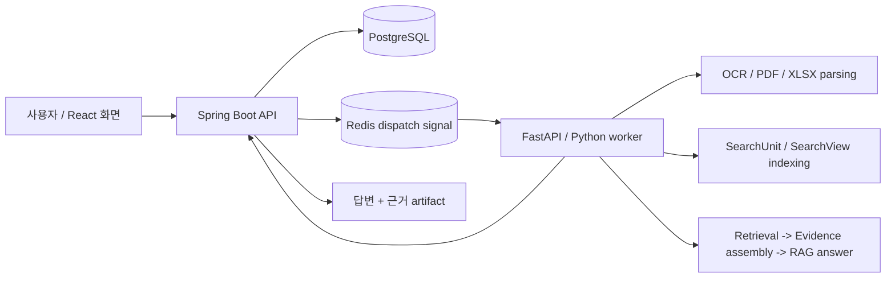

# 문서 근거 기반 AI 검색·답변 파이프라인

PDF, XLSX, TEXT 문서를 분석해 질문에 답하고, 답변의 근거가 된 원문 위치를 함께 제공하는 AI 문서 검색·질의응답 시스템입니다.

일반적인 RAG 기반 문서 QA에서 답변만 생성하는 데 그치지 않고, 사용자가 답변을 직접 검증할 수 있도록 **PDF 페이지, XLSX 시트/셀, TEXT chunk 단위의 citation**을 함께 제공하는 구조로 설계했습니다.

## 프로젝트 개요

| 항목 | 내용 |
|---|---|
| 프로젝트 성격 | 문서 검색·질의응답 AI 파이프라인 |
| 처리 문서 | TEXT, PDF, XLSX |
| 핵심 기능 | 문서 파싱, OCR, 검색 인덱싱, RAG 답변 생성, 근거 citation 표시 |
| 주요 기술 | Spring Boot, FastAPI, Python, PostgreSQL, Redis, FAISS, React/Vite |
| 설계 방향 | 오래 걸리는 AI 작업을 비동기 job으로 분리하고, 답변의 원문 근거를 추적 가능한 구조로 관리 |

## 프로젝트 목표

AI 문서 검색에서 중요한 문제는 답변의 자연스러움만이 아닙니다.  
답변이 실제 문서의 어떤 부분을 근거로 생성되었는지 확인할 수 있어야 합니다.

이 프로젝트는 다음 목표를 기준으로 구현했습니다.

| 목표 | 설명 |
|---|---|
| 문서 유형별 파싱 | PDF, XLSX, TEXT 문서를 각각의 구조에 맞게 분석 |
| 검색 가능한 단위 생성 | 문서 내용을 검색과 답변 생성에 사용할 수 있는 단위로 정리 |
| 근거 기반 답변 생성 | 질문과 관련된 원문 근거를 찾고 이를 바탕으로 답변 생성 |
| citation 제공 | 답변에 사용된 PDF page, XLSX cell/range, TEXT chunk 정보를 함께 제공 |
| 비동기 처리 | OCR, 인덱싱, RAG처럼 오래 걸리는 작업을 job pipeline으로 분리 |

## 시스템 흐름

사용자는 문서를 등록하거나 질문을 보냅니다.  
API 서버는 작업을 생성하고, AI worker는 문서 파싱, 검색 인덱싱, 근거 조립, 답변 생성을 비동기로 수행합니다.

## 주요 기능

| 영역 | 구현 내용 |
|---|---|
| 문서 등록 및 작업 관리 | 문서 처리 job 생성, 상태 조회, 결과 artifact 조회 |
| 비동기 AI 처리 | Redis signal 기반 worker dispatch, callback delivery, job 상태 추적 |
| 문서 파싱 | TEXT chunking, PDF text/table 처리, XLSX workbook 구조 및 display value 추출 |
| 검색 인덱싱 | SearchUnit/SearchView 기반 검색 단위 구성, FAISS 기반 retrieval |
| RAG 답변 생성 | 검색 결과를 기반으로 답변 생성 및 citation artifact 구성 |
| 근거 추적 | PDF page, XLSX sheet/range/cell, TEXT chunk 단위의 evidence 관리 |
| 평가 도구 | answer/citation scorer, retrieval smoke metric, diagnostic-only 결과 관리 |
| 화면 구성 | React/Vite 기반 작업 목록, 상태 timeline, 결과 preview 화면 |

## 동작 예시

아래는 이 프로젝트가 실제로 처리한 질의응답 예시입니다.  
각 응답은 단순 생성 결과가 아니라, 원문에서 확인한 근거 위치를 함께 관리합니다.

| 문서 유형 | 질문 | 확인한 근거 위치 | 응답 |
|---|---|---|---|
| PDF | 2020년 한국 원달러 기말 환율은 얼마인가요? | 최근경제동향 PDF p.65 | 2020년 한국 원달러 기말 환율은 1,088.0입니다. |
| PDF | 2024년 수출입차 금액은 얼마인가요? | 최근경제동향 PDF p.61 | 2024년 수출입차 금액은 6,836.1입니다. |
| XLSX | 2019년 2월 5호선의 승차총승객수는 몇 명입니까? | 철도 sheet, D352 | 2019년 2월 5호선의 승차총승객수는 15,446,522명입니다. |
| XLSX | 2020년 11월에 지정된 하얀민들레노인요양원의 우편번호는 무엇입니까? | 일반현황 sheet, C702 | 2020년 11월에 지정된 하얀민들레노인요양원의 우편번호는 41786입니다. |
| XLSX | 2014년 12월에 지정된 해뜨는요양원2의 시도 시군구 법정동명은 무엇입니까? | 일반현황 sheet, G752 | 해뜨는요양원2의 시도 시군구 법정동명은 대구광역시 북구 복현동입니다. |
| TEXT | 미츠하는 타키를 만나려고 어디로 향했어 | TEXT chunk/source context | 미츠하는 타키를 실제로 만나기 위해 도쿄로 향했습니다. |
| TEXT | 유우야키의 나이와 생일은 어떻게 적혀 있어 | TEXT chunk/source context | 유우야키의 나이는 16세이고 생일은 9월 29일입니다. |

더 많은 샘플과 XLSX display-value/cell-range 진단 결과는 [Evaluation harness samples](ai/eval/README.md)에 정리했습니다.

## 아키텍처 설계 포인트

### 1. AI 작업을 비동기 job pipeline으로 분리

OCR, 문서 파싱, 검색 인덱싱, RAG 답변 생성은 처리 시간이 길고 실패 가능성도 있습니다.  
이를 API 요청/응답 흐름에 직접 묶지 않고, 별도의 job pipeline으로 분리했습니다.

Spring Boot API는 job 생성과 상태 관리를 담당하고, FastAPI worker는 실제 AI 작업을 수행합니다.  
PostgreSQL은 작업 상태와 결과 저장의 기준점으로 사용하고, Redis는 worker dispatch signal 용도로 제한했습니다.

### 2. 검색 후보와 citation 근거를 분리

검색에 사용된 후보가 항상 최종 답변의 근거가 되는 것은 아닙니다.  
이 둘을 구분하지 않으면 citation 신뢰도가 떨어질 수 있습니다.

이를 줄이기 위해 검색 표현과 실제 citation 근거를 분리했습니다.

| 개념 | 역할 |
|---|---|
| SearchUnit | 검색 인덱싱의 기본 단위 |
| SearchView | retrieval candidate 구성을 위한 검색 표현 |
| SourceAtom | citation에 사용되는 원문 근거 단위 |
| Evidence contract | PDF/XLSX/TEXT 유형별 근거 표현 규칙 |

### 3. 문서 유형별 evidence 구조 설계

PDF, XLSX, TEXT는 근거를 표현하는 방식이 다릅니다.

PDF는 페이지와 문맥이 중요하고, XLSX는 sheet, range, cell, display value가 중요합니다.  
TEXT는 chunk와 source context를 기준으로 근거를 표현합니다.

이 차이를 하나의 문자열 citation으로 단순화하지 않고, 문서 유형별 evidence contract로 분리했습니다.

| 문서 유형 | citation 단위 |
|---|---|
| PDF | page, text/table context |
| XLSX | sheet, range, cell, display value |
| TEXT | chunk, source context |

### 4. 평가 결과와 운영 기준을 분리

평가 harness의 결과가 곧 운영 품질을 의미하지 않도록, 결과의 성격을 구분했습니다.

| 구분 | 의미 |
|---|---|
| diagnostic-only | 원인 분석과 개선 방향 확인용 결과 |
| promotion evidence | 인덱스나 정책 승격 판단에 사용할 수 있는 근거 |
| production promotion | 실제 운영 기준으로 반영된 상태 |

이를 통해 실험 결과, 진단 결과, 운영 승격 기준이 섞이지 않도록 관리했습니다.

## 기술 스택

| 영역 | 기술 |
|---|---|
| Backend API | Spring Boot |
| AI Worker | FastAPI, Python |
| Database | PostgreSQL |
| Dispatch / Signal | Redis |
| Retrieval | FAISS |
| Frontend | React, Vite |
| Document Processing | PDF parsing, XLSX workbook extraction, OCR |
| Evaluation | answer/citation scorer, retrieval smoke metric |

## 폴더 구조

| 경로 | 역할 |
|---|---|
| [`core-api/`](core-api/) | Spring Boot API 서버 |
| [`ai/app/`](ai/app/) | Python AI worker와 capability 구현 |
| [`ai/eval/`](ai/eval/) | RAG/OCR evaluation harness와 기준 데이터 |
| [`frontend/app/`](frontend/app/) | React/Vite UI |
| [`docker-compose.yml`](docker-compose.yml) | 로컬 PostgreSQL, Redis, 선택형 MinIO/LLM 인프라 구성 |
| [`.env.example`](.env.example) | 로컬 실행 환경 변수 예시 |
| [`docs/THIRD_PARTY_DATA_LICENSES.md`](docs/THIRD_PARTY_DATA_LICENSES.md) | 외부 데이터 및 라이선스 고지 |

## 라이선스와 외부 데이터

이 저장소의 직접 작성 코드와 문서는 [Apache License 2.0](LICENSE)을 따릅니다.

단, 외부에서 수집한 PDF, XLSX, 이미지, OCR/MM annotation, 폰트, 공공데이터, Hugging Face dataset mirror, NamuWiki metadata 등은 이 저장소의 Apache-2.0 라이선스로 재허가되지 않습니다.

원천별 이용조건과 내부 diagnostic usage gate는 [Third-party data license notice](docs/THIRD_PARTY_DATA_LICENSES.md)를 확인하세요.