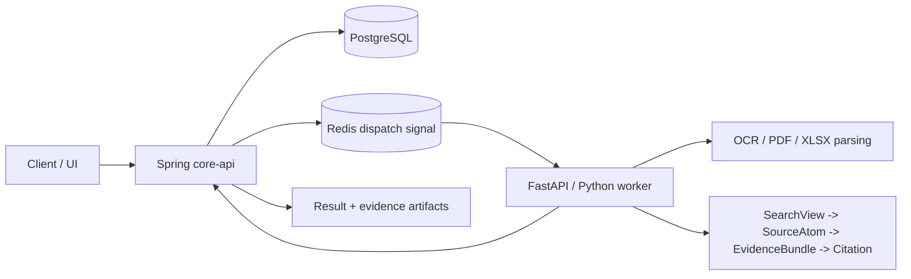

# Async AI Document Pipeline with Source-Grounded RAG

비동기 AI 문서 처리 파이프라인입니다. Spring `core-api` + FastAPI/Python worker + PostgreSQL/Redis 위에서 OCR/PDF/XLSX parsing, source-grounded RAG, evidence/citation verification을 분리해 다룹니다.

문서가 들어오면 긴 AI 작업을 request/response에 묶지 않고 job으로 처리하고, 답변이 어떤 TEXT chunk, PDF page, XLSX sheet/range/cell evidence에 묶였는지 추적합니다.

## What This Project Demonstrates

- 긴 OCR/RAG 작업을 동기 API 응답에 묶지 않고 async job pipeline으로 처리합니다.
- PostgreSQL을 durable state 기준점으로 두고 Redis는 worker dispatch signal로만 사용합니다.
- TEXT/PDF/XLSX를 하나의 RAG evidence로 뭉개지 않고 source family별 contract를 분리합니다.
- `SearchView -> SourceAtom -> EvidenceBundle -> Citation render` 흐름으로 retrieval candidate와 citation truth를 분리합니다.
- 실제 사용자 쿼리, retrieval/evidence surface, LLM response 샘플을 함께 제공합니다.
- metric/eval harness를 production path와 분리하고, diagnostic-only 결과와 promotion evidence / production promotion을 구분합니다.

## Source-First Evidence Contract

| Layer | 역할 |
|---|---|
| SearchView | Vector/BM25 retrieval candidate. 빠르게 찾기 위한 표면이며 citation truth가 아닙니다. |
| SourceAtom | Source registry가 소유하는 canonical evidence 단위입니다. |
| EvidenceBundle | SourceAtom을 hydrate해서 답변 context와 citation payload로 조립합니다. |
| Citation render | 답변이 실제 source evidence에 묶였는지 보여주는 최종 표면입니다. |

FAISS/vector index metadata는 candidate generation only입니다. Citation truth는 SourceAtom/source registry에서 가져오며, expected answer/supporting evidence/gold fields는 generation source로 사용하지 않습니다.


## Recent Focus: PDF/XLSX RAG Support

| Track | Query | Evidence surface | Response |
|---|---|---|---|
| PDF | 2020년 한국 원달러 기말 환율은 얼마인가요? | PDF page citation: 최근경제동향 PDF p.65 | 2020년 한국 원달러 기말 환율은 1,088.0입니다. |
| PDF | 2024년 수출입차 금액은 얼마인가요? | PDF page citation: 최근경제동향 PDF p.61 | 2024년 수출입차 금액은 6,836.1입니다. |
| XLSX | 2019년 2월 5호선의 승차총승객수는 몇 명입니까? | XLSX sheet/range/cell: 철도 sheet, D352 | 2019년 2월 5호선의 승차총승객수는 15,446,522명입니다. |
| XLSX | 2020년 11월에 지정된 하얀민들레노인요양원의 우편번호는 무엇입니까? | XLSX sheet/range/cell: 일반현황 sheet, C702 | 2020년 11월에 지정된 하얀민들레노인요양원의 우편번호는 41786입니다. |
| XLSX | 2014년 12월에 지정된 해뜨는요양원2의 시도 시군구 법정동명은 무엇입니까? | XLSX sheet/range/cell: 일반현황 sheet, G752 | 해뜨는요양원2의 시도 시군구 법정동명은 대구광역시 북구 복현동입니다. |
| TEXT | 미츠하는 타키를 만나려고 어디로 향했어 | TEXT chunk/source context | 미츠하는 타키를 실제로 만나기 위해 도쿄로 향했습니다. |
| TEXT | 유우야키의 나이와 생일은 어떻게 적혀 있어 | TEXT chunk/source context | 유우야키의 나이는 16세이고 생일은 9월 29일입니다. |

이 표는 representative benchmark가 아니라, query -> evidence -> response 경로를 빠르게 보여주는 diagnostic/portfolio-facing sample입니다. 더 많은 샘플과 v3_22 XLSX display-value/cell-range 진단 표면은 [Evaluation harness samples](ai/eval/README.md)에 분리했습니다.

## Architecture



| 영역 | 구현 내용 |
|---|---|
| API | job 생성/조회, artifact 조회, document catalog, SearchUnit indexing, index build/eval/promote/rollback endpoint |
| Worker | FastAPI task endpoint, Redis consumer, callback delivery, capability registry |
| OCR/PDF/XLSX | Tesseract/PaddleOCR 옵션, PDF text/table 처리, XLSX workbook 기반 구조 추출 |
| RAG | SearchUnit/SearchView 기반 indexing, source-family별 evidence assembly, citation verification |
| Eval | answer/citation scorer, retrieval smoke metric, silver/gold boundary guard |
| UI | 작업 목록, 상태 timeline, 결과 preview 중심의 React/Vite 화면 |

## Repo Map

| Path | 역할 |
|---|---|
| [`core-api/`](core-api/) | Spring Boot API 서버 |
| [`ai/app/`](ai/app/) | Python AI worker와 capability 구현 |
| [`ai/eval/`](ai/eval/) | RAG/OCR evaluation harness와 기준 데이터 |
| [`frontend/app/`](frontend/app/) | React/Vite UI |
| [`docker-compose.yml`](docker-compose.yml) | 로컬 PostgreSQL, Redis, 선택형 MinIO/LLM 인프라 |
| [`.env.example`](.env.example) | 로컬 실행 환경 변수 예시 |

세부 run별 수치와 경계는 아래 문서에서 확인합니다.

- [RAG ingestion progress](docs/rag-ingestion-progress.md)
- [RAG ingestion measurements](docs/rag-ingestion-measurements.md)
- [RAG ingestion triage](docs/rag-ingestion-triage.md)
- [Evaluation harness](ai/eval/README.md)
- [Third-party data license notice](docs/THIRD_PARTY_DATA_LICENSES.md)

[RAG ingestion triage](docs/rag-ingestion-triage.md)는 row-level diagnostic history입니다. 외부 공유용 첫 화면이 아니라 내부 queue/decision boundary 확인용입니다.

## Local Runtime Notes

로컬 인프라는 기본적으로 PostgreSQL과 Redis를 띄웁니다.

```powershell
docker compose up -d
```

애플리케이션은 개발 중 디버깅을 쉽게 하기 위해 각각 로컬 프로세스로 실행하는 구조입니다.

- `core-api`: Java 21 / Maven / Spring Boot
- `ai`: Python / FastAPI / FAISS / sentence-transformers
- `frontend/app`: React / Vite / pnpm

대형 local corpus/runtime payload와 legacy root-level report artifacts는 repo 밖의 external runtime archive로 이동했습니다. 현재 pytest profile이 직접 읽는 `ai/eval/reports/rag-ingestion/`, `ai/eval/source_registry/`, `ai/eval/indexes/` generated evidence는 검증 경로 보존을 위해 local-only로 유지합니다.

## License

이 저장소의 직접 작성 코드와 문서는 [Apache License 2.0](LICENSE)을 따릅니다.

단, 외부에서 수집한 PDF, XLSX, 이미지, OCR/MM annotation, 폰트, 공공데이터, Hugging Face dataset mirror, NamuWiki metadata 등은 이 저장소의 Apache-2.0 라이선스로 재허가되지 않습니다. 
원천별 이용조건과 현재 내부 diagnostic usage gate는 [Third-party data license notice](docs/THIRD_PARTY_DATA_LICENSES.md)를 확인하세요.
