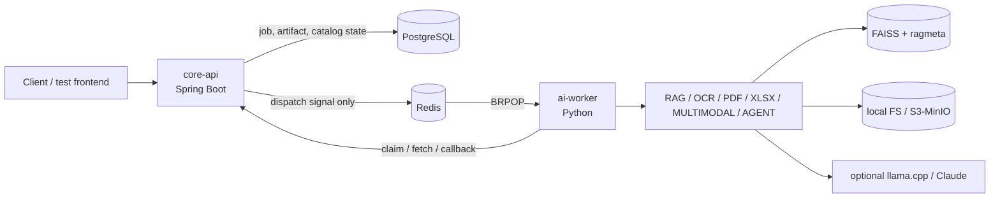

# Async OCR/RAG Multimodal Pipeline

Spring Boot `core-api`와 Python `ai-worker`를 분리한 비동기 AI 문서 처리 파이프라인입니다. PostgreSQL이 job/catalog/indexing 상태의 source of truth이고, Redis는 worker를 깨우는 dispatch signal로만 사용합니다.

이 저장소는 단순 LLM 호출 데모가 아니라, OCR/RAG/multimodal/LLM 기반 작업을 백엔드 서비스 구조 안에서 안정적으로 실행하고 검증하는 프로젝트입니다.

## Performance Snapshot

| Area | Current Evidence | Interpretation |
|---|---:|---|
| Text retrieval hit@1 | `0.595 -> 0.815` | v4 silver-200 A/B에서 embedding text 개선 효과 확인 |
| Text retrieval hit@10 | `0.795 -> 0.985` | 같은 코퍼스/쿼리셋 안에서의 paired 비교 |
| Text retrieval MRR@10 | `0.663 -> 0.882` | 순위 품질도 함께 개선 |
| Selected retrieval config | `top_k=10`, `candidate_k=40`, MMR `lambda=0.70` | 운영 적용 후보는 정해졌고, latency는 canary 모니터링 대상 |
| XLSX citation/location | `0.8857 -> 1.0`, hidden leakage `0` | diagnostic evidence; answer promotion과는 분리 |
| TEXT citation support | `29/29` supported on deterministic diagnostic denominator | live LLM answer 품질 증명은 아님 |

주의: 위 숫자는 각각의 검증 범위 안에서만 해석해야 합니다. 특히 silver/eval/diagnostic 결과를 human-gold accuracy나 production answer quality로 부풀리지 않습니다.

## Current Status

| Area | State | Notes |
|---|---|---|
| Async job pipeline | active | job/artifact/claim/callback, PostgreSQL state, Redis BRPOP dispatch |
| Worker capabilities | active | `MOCK`, `RAG`, `OCR_EXTRACT`, `XLSX_EXTRACT`, `PDF_EXTRACT`; optional `OCR`, `MULTIMODAL`, `AUTO`, `AGENT` are dependency-gated |
| Text RAG | active | FAISS + `bge-m3`; current embedding text defaults to `retrieval_title_section` |
| RAG ingestion v2 | active diagnostics | SearchUnit identity, citation/location metadata, hidden-content guardrails |
| Local LLM path | optional and wired | llama.cpp GGUF profile + OpenAI-compatible provider; Claude also supported |
| Multimodal path | opt-in | OCR + vision + existing text-RAG fusion; not the default promoted retrieval path |
| Legacy eval paths | retired | current eval home is `ai-worker/eval/`; v2/v3 numbers are historical only |

## What This Demonstrates

- Durable async AI jobs: submit, persist, dispatch, claim, execute, upload artifacts, callback.
- Clear state ownership: PostgreSQL owns durable truth; Redis never owns job status.
- Capability isolation: optional RAG/OCR/PDF/XLSX/multimodal/agent paths register independently and fail closed.
- Retrieval measurement: paired retrieval A/B, selected retrieval config, confidence/answerability scaffolding, latency caveats.
- Document ingestion hardening: SearchUnit identity, scoped indexing, citation/location metadata, and hidden-content protection.
- Local-first LLM experimentation: llama.cpp/GGUF and Claude share one provider seam while diagnostics stay separate from promotion claims.

## Architecture



The primary worker runtime is `python -m app.main`, which consumes Redis and drives `TaskRunner`. SearchUnit indexing is an operational CLI, not a public route.

## Local Run

Default compose starts infrastructure only: PostgreSQL on host `5433` and Redis on `6379`.

```bash
docker compose up -d
```

Start `core-api`:

```bash
cd core-api
mvn spring-boot:run
```

Start `ai-worker`:

```bash
cd ai-worker
python -m venv .venv
.venv\Scripts\activate
pip install -r requirements.txt
python -m app.main
```

Smoke test:

```bash
cd ai-worker
python scripts/operational/e2e_smoke.py
```

Optional local LLM:

```bash
docker compose --profile llm up -d

AIPIPELINE_WORKER_LLM_BACKEND=llamacpp
AIPIPELINE_WORKER_LLM_LLAMACPP_BASE_URL=http://localhost:8081/v1
AIPIPELINE_WORKER_LLM_LLAMACPP_MODEL=gemma4-e2b-local
```

Full setup notes are in [`docs/local-run.md`](docs/local-run.md).

## Repository Map

```text
.
├── core-api/          Spring Boot API, job/catalog/indexing state, Flyway migrations
├── ai-worker/
│   ├── app/           Worker runtime, capabilities, clients, storage, CLI
│   ├── scripts/       Operational, ingestion, diagnostic, and eval helper CLIs
│   ├── eval/          Canonical eval inputs, corpora, reports, indexes, harnesses
│   └── fixtures/      Small worker fixtures and manifests
├── docs/              Architecture, local run, RAG ingestion, eval policies
├── frontend/          Minimal test client
├── local-storage/     Default local artifact storage
├── archive/           Historical generated outputs and retired material
└── docker-compose.yml Local infra plus optional MinIO and llama.cpp profiles
```

Current worker-owned paths:

| Material | Current home |
|---|---|
| Worker scripts | `ai-worker/scripts/` |
| SearchUnit indexing CLI | `ai-worker/app/cli/search_unit_indexing.py` |
| Eval harness and reports | `ai-worker/eval/` |
| RAG ingestion reports | `ai-worker/eval/reports/rag-ingestion/` |
| FAISS/vector artifacts | `ai-worker/eval/indexes/` |

Root-level `scripts/`, `eval/`, `evals/`, `samples/`, `datasets/`, `reports/`, `rag-data*`, `ai-worker/evals/`, and `ai-worker/ai_worker/` are retired path families.

## Docs

| Topic | Document |
|---|---|
| Architecture | [`docs/architecture.md`](docs/architecture.md) |
| Local run | [`docs/local-run.md`](docs/local-run.md) |
| Repository/path policy | [`docs/repo-structure.md`](docs/repo-structure.md) |
| API contracts | [`docs/api-summary.md`](docs/api-summary.md) |
| Eval harness | [`ai-worker/eval/README.md`](ai-worker/eval/README.md) |
| RAG ingestion progress | [`docs/rag-ingestion-progress.md`](docs/rag-ingestion-progress.md) |
| Eval policies | [`docs/eval/`](docs/eval/) |

## Boundaries

- Diagnostic PASS does not mean production promotion.
- Silver/eval metrics do not mean human-gold accuracy.
- Local llama.cpp diagnostics do not prove external/cloud LLM production quality.
- PageIndex tree success is not bbox/table/citation success.
- Multimodal is available as an opt-in path, not the default promoted retrieval/generation path.
