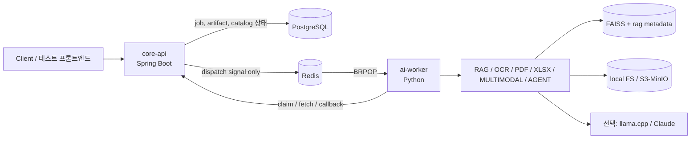

# 비동기 OCR/RAG 멀티모달 문서 처리 파이프라인

Spring Boot `core-api`와 Python `ai-worker`를 분리해 만든 비동기 AI 문서 처리 파이프라인입니다. 이 저장소의 초점은 단순한 LLM 호출 예제가 아니라, OCR, RAG, PDF/XLSX ingestion, 멀티모달 처리, 로컬 LLM 실험을 백엔드 작업 흐름 안에서 안전하게 실행하고 검증하는 구조입니다.

핵심 상태는 PostgreSQL이 소유합니다. Redis는 작업 상태 저장소가 아니라 worker를 깨우는 dispatch signal로만 사용합니다. Worker는 Redis 신호를 받더라도 바로 실행하지 않고, 먼저 `core-api`에 claim을 요청해 실행 소유권을 확보한 뒤 작업을 처리합니다.

## 한눈에 보기

| 영역 | 현재 상태 | 의미 |
|---|---|---|
| 비동기 작업 파이프라인 | 동작 중 | job 생성, artifact 관리, claim, 실행, callback 흐름 구현 |
| Worker capability | 동작 중 | `MOCK`, `RAG`, `OCR_EXTRACT`, `XLSX_EXTRACT`, `PDF_EXTRACT` 중심 |
| Text RAG | 동작 중 | FAISS + `bge-m3`, v4 retrieval 진단 경로 유지 |
| RAG ingestion v2 | 진단 진행 중 | SearchUnit identity, citation/location metadata, hidden content guardrail 검증 |
| XLSX/PDF/Text 평가 | 진단 전용 | 위치/인용/answer-shape 검증은 promotion evidence와 분리 |
| 로컬 LLM | 선택 기능 | llama.cpp GGUF 서버와 OpenAI-compatible provider 지원 |
| 멀티모달 | 선택 기능 | OCR + vision + text RAG fusion 실험 경로 |

## 성능과 증거 해석

| 항목 | 관측값 | 해석 |
|---|---:|---|
| Text retrieval hit@1 | `0.595 -> 0.815` | v4 silver-200 A/B에서 embedding text 개선 효과 확인 |
| Text retrieval hit@10 | `0.795 -> 0.985` | 같은 코퍼스와 쿼리셋에서 paired 비교 |
| Text retrieval MRR@10 | `0.663 -> 0.882` | 정답 순위 품질도 함께 개선 |
| 선택된 retrieval 설정 | `top_k=10`, `candidate_k=40`, MMR `lambda=0.70` | 운영 후보 설정이며 latency는 canary 모니터링 대상 |
| XLSX citation/location | `0.8857 -> 1.0`, hidden leakage `0` | diagnostic evidence이며 answer promotion과 별개 |
| TEXT citation support | deterministic denominator에서 `29/29` supported | live LLM answer 품질 증명은 아님 |

위 숫자는 각각의 평가 범위 안에서만 읽어야 합니다. Silver/eval/diagnostic 결과를 human-gold accuracy나 production answer quality로 확대 해석하지 않습니다.

## 이 프로젝트가 보여주는 것

- 안정적인 AI job 처리: submit, persist, dispatch, claim, execute, artifact upload, callback.
- 명확한 상태 소유권: PostgreSQL은 durable truth, Redis는 깨우기 신호.
- Capability 분리: RAG/OCR/PDF/XLSX/multimodal/agent 경로를 독립적으로 등록하고 dependency가 없으면 fail-closed.
- Retrieval 측정: paired A/B, retrieval config 선택, confidence/answerability scaffolding, latency caveat.
- 문서 ingestion hardening: SearchUnit identity, scoped indexing, citation/location metadata, hidden-content protection.
- 로컬 우선 LLM 실험: llama.cpp/GGUF와 Claude provider를 같은 chat provider 계약으로 연결.

## 구조



주요 worker runtime은 `python -m app.main`입니다. SearchUnit indexing은 공개 API가 아니라 운영용 CLI 경로로 다룹니다.

## 로컬 실행

기본 compose는 PostgreSQL과 Redis 중심의 인프라만 띄웁니다. PostgreSQL은 host `5433`, Redis는 `6379`를 사용합니다.

```bash
docker compose up -d
```

`core-api` 실행:

```bash
cd core-api
mvn spring-boot:run
```

`ai-worker` 실행:

```bash
cd ai-worker
python -m venv .venv
.venv\Scripts\activate
pip install -r requirements.txt
python -m app.main
```

간단한 end-to-end smoke:

```bash
cd ai-worker
python scripts/operational/e2e_smoke.py
```

## 로컬 LLM 선택 실행

llama.cpp 서버는 선택 profile입니다. 기본 host publish는 localhost 바인딩을 사용합니다.

```bash
docker compose --profile llm up -d
```

Worker에서 llama.cpp를 사용하려면:

```bash
AIPIPELINE_WORKER_LLM_BACKEND=llamacpp
AIPIPELINE_WORKER_LLM_LLAMACPP_BASE_URL=http://localhost:8081/v1
AIPIPELINE_WORKER_LLM_LLAMACPP_MODEL=gemma4-e2b-local
```

`API_KEY=EMPTY` 형태의 로컬 설정은 localhost-only 전제를 둔 개발용 설정입니다. 외부 네트워크에 노출하는 구성으로 사용하지 않습니다.

## 저장소 지도

```text
.
├── core-api/          Spring Boot API, job/catalog/indexing 상태, Flyway migration
├── ai-worker/
│   ├── app/           worker runtime, capability, client, storage, CLI
│   ├── scripts/       운영, ingestion, diagnostic, eval 보조 CLI
│   ├── eval/          eval harness와 README 중심의 평가 작업 공간
│   └── fixtures/      작은 fixture와 manifest
├── docs/              README 중심의 트랙별 문서
├── frontend/          테스트용 프론트엔드
├── local-storage/     기본 로컬 artifact 저장소
├── archive/           오래된 스크립트와 보존 자료
└── docker-compose.yml 로컬 인프라와 선택 profile
```

현재 유효한 worker 중심 경로:

| 자료 | 위치 |
|---|---|
| Worker 스크립트 | `ai-worker/scripts/` |
| SearchUnit indexing CLI | `ai-worker/app/cli/search_unit_indexing.py` |
| Eval harness | `ai-worker/eval/` |
| RAG ingestion report 안내 | `ai-worker/eval/reports/rag-ingestion/README.md` |
| RAG/XLSX/PDF/Text 트랙 README | `docs/` 아래 각 `README.md` |

루트의 `scripts/`, `eval/`, `evals/`, `samples/`, `datasets/`, `reports/`, `rag-data*`, `ai-worker/evals/`, `ai-worker/ai_worker/` 계열은 retired path로 봅니다.

## Git에 넣지 않는 것

이 저장소는 현재 데이터와 생성 산출물을 넓게 제외합니다. 새 클론은 모든 실험 데이터와 report artifact를 그대로 갖고 있지 않을 수 있습니다.

- `*.pdf`
- `*.csv`
- `*.jsonl`
- `*.json`
- `datasets/`
- `ai-worker/eval/artifacts/`
- `README.md`가 아닌 대부분의 `*.md`

따라서 README와 코드가 canonical entrypoint이고, 데이터셋, 실행 결과, 대용량 report는 로컬에서 다시 준비하거나 별도 보관본을 사용해야 합니다.

## 읽을 만한 README

| 주제 | 문서 |
|---|---|
| Eval 전체 구조 | [`ai-worker/eval/README.md`](ai-worker/eval/README.md) |
| Eval query 정책 | [`ai-worker/eval/eval_queries/README.md`](ai-worker/eval/eval_queries/README.md) |
| Script 위치와 역할 | [`ai-worker/scripts/README.md`](ai-worker/scripts/README.md) |
| RAG ingestion report 정리 | [`ai-worker/eval/reports/rag-ingestion/README.md`](ai-worker/eval/reports/rag-ingestion/README.md) |
| XLSX retrieval 트랙 | [`docs/rag-ingestion/xlsx-retrieval/README.md`](docs/rag-ingestion/xlsx-retrieval/README.md) |
| PDF preparation 트랙 | [`docs/track-c-pdf-embedding-preparation/README.md`](docs/track-c-pdf-embedding-preparation/README.md) |
| Text retrieval 트랙 | [`docs/track_b_text_retrieval_e2e/README.md`](docs/track_b_text_retrieval_e2e/README.md) |

## 주의할 경계

- Diagnostic PASS는 production promotion을 의미하지 않습니다.
- Silver/eval metric은 human-gold accuracy가 아닙니다.
- Local llama.cpp 진단은 외부/cloud LLM 운영 품질 증명이 아닙니다.
- PageIndex tree 성공은 bbox/table/citation 성공과 다릅니다.
- Multimodal은 opt-in 실험 경로이며 기본 promoted retrieval/generation 경로가 아닙니다.

## 빠른 검증 명령

최근 정리 후 사용한 최소 검증 예시는 다음과 같습니다.

```bash
python -m pytest -q ai-worker/tests/test_llm_chat.py
docker compose --profile llm config --quiet
git diff --check
```

더 넓은 평가나 ingestion 진단은 로컬 데이터와 생성 산출물 준비 여부에 따라 별도로 실행합니다.
