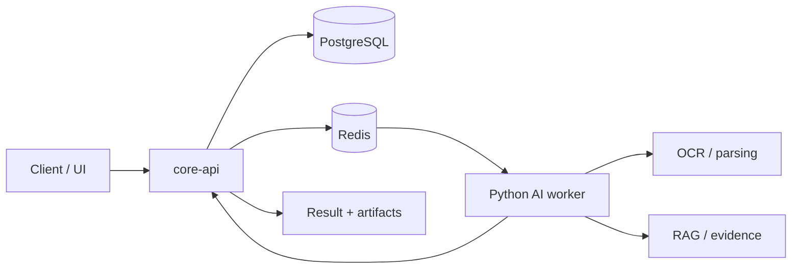

# Async AI Document Pipeline with Domain RAG

문서가 들어오면 처리 상태를 잃지 않고, OCR/파싱/검색/RAG 결과를 근거와 함께 돌려주는 비동기 AI 문서 처리 파이프라인입니다.

핵심은 RAG 답변을 만드는 데서 멈추지 않고, 답변이 어떤 텍스트 조각, 셀, 페이지, bbox를 근거로 삼았는지 추적하는 것입니다. TEXT, XLSX, PDF마다 다른 evidence 구조를 분리해 두고, 평가 harness에서 검색/근거/인용 경계를 따로 확인합니다.

## 한눈에 보기

| 구분 | 내용 |
|---|---|
| 목표 | 문서 업로드부터 AI 처리, 검색, 답변, 근거 검증까지 이어지는 end-to-end 파이프라인 |
| 백엔드 | Spring Boot `core-api`, PostgreSQL, Redis, Flyway/JPA |
| AI 워커 | Python/FastAPI 기반 OCR, PDF/XLSX 파싱, RAG, evaluation harness |
| 프론트엔드 | React/Vite 기반 작업 제출 및 결과 확인 UI |
| 핵심 설계 | 긴 AI 작업은 비동기 job으로 분리하고, DB를 상태의 기준점으로 사용 |
| 현재 단계 | 포트폴리오/POC 단계. `v3_7_2` source-registry-backed retrieval smoke까지 산출했고 production promotion은 아직 열지 않음 |

## 이 프로젝트로 보여주는 역량

### 1. 비동기 AI 백엔드 설계

AI 작업은 오래 걸리고 실패 가능성도 높습니다. 이 저장소는 요청-응답 흐름에 AI 처리를 직접 묶지 않고, `core-api`가 작업과 산출물 상태를 관리하며 Python worker가 claim/callback 방식으로 처리하도록 분리했습니다.

- `core-api`: job, artifact, document catalog, SearchUnit/index 상태 관리
- `ai` worker: OCR, 문서 파싱, RAG 처리, 결과 callback
- PostgreSQL: durable truth
- Redis: worker를 깨우는 dispatch signal
- local storage 또는 MinIO: 산출물 저장소

### 2. 문서 타입별 RAG 구조화

문서 검색은 단순히 "비슷한 텍스트 chunk"를 찾는 문제가 아닙니다. 이 프로젝트는 TEXT, XLSX, PDF를 하나의 점수로 섞지 않고, 각 타입에 맞는 근거 구조를 따로 둡니다.

| Track | 다루는 문서 | 근거로 남기는 정보 |
|---|---|---|
| TEXT | 텍스트 corpus | chunk, source id, 문맥 |
| XLSX | 스프레드시트 | workbook, sheet, table/range, row/column, matched cell |
| PDF | PDF/OCR 문서 | file identity, page, bbox, matched text, nearby paragraph |

이 구조 덕분에 "답이 맞아 보인다"가 아니라 "어느 셀, 어느 페이지, 어느 문단을 근거로 답했는지"를 추적할 수 있습니다.

### 3. 재현 가능한 평가 체계

평가 코드는 production path와 분리되어 있고, 각 run은 denominator와 artifact를 남깁니다. 이 구조 덕분에 "답변이 그럴듯한가"와 "근거 후보가 실제 citation으로 살아남는가"를 따로 볼 수 있습니다.

- official answer/citation baseline, retrieval smoke, local LLM response sample을 분리해 관리합니다.
- TEXT/XLSX/PDF는 서로 다른 denominator로 읽고 임의 평균으로 합치지 않습니다.
- gold, silver, diagnostic-only 데이터를 구분하고 gold/qrels/label 변경 여부를 run summary에 남깁니다.
- vector DB는 후보 생성 장치로만 쓰고, citation truth는 SourceAtom/source registry에서 hydrate합니다.
- 외부 데이터 라이선스와 공개 가능 여부를 별도 문서로 관리합니다.

포트폴리오 관점에서 봐야 할 포인트는 높은 숫자 하나보다, 비동기 처리와 RAG evidence contract를 실제 코드와 산출물로 끝까지 추적했다는 점입니다.

### 4. 현재 진단 지표 스냅샷

아래 수치는 현재 RAG 근거 구조가 어디까지 재현 가능하게 측정됐는지 보여주는 checkpoint입니다. `same-track@k`는 쿼리와 같은 source family의 후보가 top-k에 들어왔는지, `target@k`는 매핑된 target SearchView/SourceAtom이 top-k에 들어왔는지, `contract survival`은 SearchView 후보가 SourceAtom, EvidenceBundle, citation render까지 살아남았는지를 봅니다. `Hit@K/MRR/nDCG`는 과거 exact-evidence smoke의 regression guard로만 읽습니다.

| Surface | Denominator / sample | 현재 값 | 읽는 법 |
|---|---:|---|---|
| Source registry-backed retrieval smoke `v3_7_2` | 1,029 query surfaces: official 29 + diagnostic silver 1,000 | same-track@k: TEXT `356/356`, PDF `329/329`, XLSX `344/344`; target@k: TEXT `20/356`, PDF `112/329`, XLSX `13/344`; contract survival: TEXT `1780/1780`, PDF `1645/1645`, XLSX `1720/1720` | 현재 가장 최신 contract smoke입니다. same-track@k는 family routing 확인값이고, ranking/materialization 품질은 target@k와 failure bucket으로 읽습니다. |
| Source-first citable index `v3_7_1` | 136,280 SearchViews | TEXT `135,608`, PDF `329`, XLSX `343`; source registry ready, index load check pass | `v3_7_2`의 immutable input index입니다. vector metadata는 canonical citation source가 아니며 SourceAtom에서 hydrate합니다. |
| Official exact-evidence retrieval smoke `v3_4_3` | 28 included queries | Hit@1 `27/28` = `96.4%`, Hit@3 `28/28`, Hit@5 `28/28`, MRR@5 `0.982`, binary exact-evidence nDCG@5 `0.987` | 작은 source-bound regression smoke입니다. 현재 v3.7 contract smoke와 denominator가 다릅니다. |
| Answer/citation closure `v3_2_7` | 29 official rows | Lane A `24/29`, Lane B retrieval top-k `27/29`, Lane C query-bound oracle `27/29`; citation support average `1.0` | answer/citation gold 기준의 diagnostic closure입니다. Lane A/B/C를 하나의 점수로 합치지 않습니다. |
| Historical local LLM docs sample | 100 rows, gold 25 / silver 75 | p95 latency `0.464s`, p99 latency `0.516s`, max `0.528s` | `gemma4-e2b-local`에 `query + SearchView evidence`만 보낸 응답 샘플입니다. throughput/SLA가 아니라 입력 정책과 재현성 확인용입니다. |

숫자의 자세한 출처, denominator 경계, gold/silver 샘플 응답은 [Evaluation harness](ai/eval/README.md)에서 이어서 확인합니다. 루트 README는 요약이고, `ai/eval/README.md`가 현재 평가 상태를 읽는 기준 문서입니다.

## 전체 흐름



1. 사용자가 문서 처리 작업을 생성합니다.
2. `core-api`가 job과 artifact 상태를 PostgreSQL에 기록합니다.
3. Redis는 worker에게 처리할 작업이 있음을 알립니다.
4. Python worker가 작업을 claim한 뒤 OCR, PDF/XLSX 파싱, RAG 처리를 수행합니다.
5. 결과와 근거 artifact가 callback으로 저장됩니다.
6. 평가 harness는 결과가 어떤 근거를 사용했는지 별도 진단합니다.

## 구현 범위

| 영역 | 구현 내용 |
|---|---|
| API | job 생성/조회, artifact 조회, document catalog, SearchUnit indexing, index build/eval/promote/rollback endpoint |
| Worker | FastAPI task endpoint, Redis consumer, callback delivery, capability registry |
| OCR/PDF/XLSX | Tesseract/PaddleOCR 옵션, PDF text/table 처리, XLSX workbook 기반 구조 추출 |
| RAG | SearchUnit 기반 indexing, vector retrieval, track별 evidence assembly, citation verification |
| Eval | answer/citation scorer, retrieval smoke metric, silver/gold boundary guard |
| UI | 작업 목록, 상태 timeline, 결과 preview 중심의 React 화면 |

## 현재 상태를 읽는 법

이 저장소는 portfolio/POC 기준으로 다음을 보여주는 데 초점을 둡니다.

- 비동기 AI 처리의 기본 골격이 실제 코드로 구현되어 있음
- 문서 타입별 근거 구조를 분리해서 관리함
- 검색/답변/인용 결과를 작은 기준 세트로 반복 검증함
- 외부 데이터, hidden XLSX content, PDF file identity 같은 위험 지점을 성능 숫자보다 먼저 통제함

더 자세한 run별 수치와 경계는 아래 문서에서 확인할 수 있습니다.

- [RAG ingestion progress](docs/rag-ingestion-progress.md)
- [RAG ingestion measurements](docs/rag-ingestion-measurements.md)
- [RAG ingestion triage](docs/rag-ingestion-triage.md)
- [Evaluation harness](ai/eval/README.md)
- [Third-party data license notice](docs/THIRD_PARTY_DATA_LICENSES.md)

## 빠르게 둘러보기

| Path | 역할 |
|---|---|
| [`core-api/`](core-api/) | Spring Boot API 서버 |
| [`ai/app/`](ai/app/) | Python AI worker와 capability 구현 |
| [`ai/eval/`](ai/eval/) | RAG/OCR evaluation harness와 기준 데이터 |
| [`frontend/app/`](frontend/app/) | React/Vite UI |
| [`docker-compose.yml`](docker-compose.yml) | 로컬 PostgreSQL, Redis, 선택형 MinIO/LLM 인프라 |
| [`.env.example`](.env.example) | 로컬 실행 환경 변수 예시 |

## 로컬 실행 개요

로컬 인프라는 기본적으로 PostgreSQL과 Redis만 띄웁니다.

```powershell
docker compose up -d
```

애플리케이션은 개발 중 디버깅을 쉽게 하기 위해 각각 로컬 프로세스로 실행하는 구조입니다.

- `core-api`: Java 21 / Maven / Spring Boot
- `ai`: Python / FastAPI / FAISS / sentence-transformers
- `frontend/app`: React / Vite / pnpm

세부 실행 옵션은 각 디렉토리의 설정 파일과 `.env.example`을 기준으로 확인합니다.

## 라이선스

이 저장소의 직접 작성 코드와 문서는 [Apache License 2.0](LICENSE)을 따릅니다.

단, 외부에서 수집한 PDF, XLSX, 이미지, OCR/MM annotation, 폰트, 공공데이터, Hugging Face dataset mirror, NamuWiki metadata 등은 이 저장소의 Apache-2.0 라이선스로 재허가되지 않습니다. 원천별 이용조건과 현재 내부 diagnostic usage gate는 [Third-party data license notice](docs/THIRD_PARTY_DATA_LICENSES.md)를 확인하세요.
