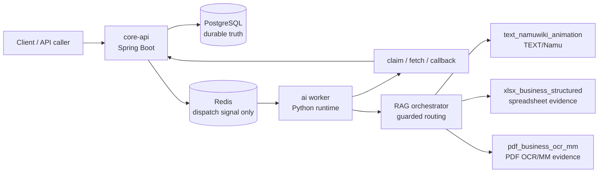

# Async AI Document Pipeline with Domain RAG

Spring Boot `core-api`와 Python `ai` worker를 분리한 비동기 문서 AI 처리 파이프라인입니다. 현재 이 저장소의 핵심은 하나의 통합 RAG 점수가 아니라, TEXT/XLSX/PDF를 분리한 3트랙 RAG 아키텍처와 diagnostic-only metric gate입니다.

PostgreSQL은 job, artifact, catalog, SearchUnit 상태의 durable truth입니다. Redis는 worker를 깨우는 dispatch signal로만 사용하며, worker는 실행 전 `core-api` claim을 통해 작업 소유권을 확보합니다.

## 현재 상태

기준 시점: 2026-05-14 KST. 전체 상태는 `diagnostic_pipeline_ready_for_review`이고, production promotion과 model-quality tuning은 아직 blocked입니다. 현재 metric preflight는 `DIAGNOSTIC_PREFLIGHT_BLOCKED`이며, official metric과 official denominator는 아직 열지 않았습니다.

| Metric surface | 현재 값 | 의미 |
|---|---:|---|
| Official metric input rows | TEXT `0`, XLSX `0`, PDF `0` | 세 트랙 모두 official metric 입력은 닫혀 있음 |
| Cross-track averages | `false` | TEXT/XLSX/PDF 평균값을 만들지 않음 |
| Promotion evidence | `false` | production promotion 증거로 쓰지 않음 |
| Official denominator registry mutation | `false` | denominator registry 변경 없음 |
| Production vector/index mutation | `false` | production namespace, vector, index write 없음 |
| Route/fallback labels | diagnostic-only | route accuracy, fallback success는 아직 official metric 아님 |

## 3트랙 아키텍처

| Track | 범위 | Retrieval/evidence contract |
|---|---|---|
| `text_namuwiki_animation` | Namuwiki animation-domain TEXT RAG | 별도 TEXT denominator, source-bound answer/citation review, NAMU license guard |
| `xlsx_business_structured` | Business spreadsheet structured RAG | sheet, table, range, row, column, matched cells, citation locator, hidden/excluded-row guard |
| `pdf_business_ocr_mm` | Business PDF OCR/MM RAG | page, bbox, region, matched text, nearby paragraphs, OCR/native-text trust, FILE vs CONTENT lane separation |

이 세 트랙은 하나의 namespace, retrieval contract, denominator, quality average로 합치지 않습니다.

## XLSX/PDF Evidence 검색 방식

현재 orchestrator는 query와 source metadata guard로 트랙을 먼저 좁힌 뒤, 후보 검색과 evidence context assembly를 분리합니다. POC vector wrapper는 아직 bounded overfetch plus post-filtering을 사용하므로, production promotion 전에는 tenant/ACL/source type/parser/index/embedding 상태를 vector ranking 전이나 내부에서 fail-closed로 강제해야 합니다.

- XLSX: Spreadsheet SearchUnit 후보를 찾은 뒤, workbook을 다시 열거나 hidden 상태를 새로 probe하지 않고 retrieved Evidence의 `location_json`과 retriever metadata만 사용합니다. Context는 `sheet`, `table_id`, `table_range`, `matched_cells`, `header_rows`, `target_rows`, `target_columns`, `row_values`, `column_headers`, `nearby_rows`, `merged_cell_context`, `table_title_candidate`로 조립합니다. `row_values`, `column_headers`, `header_rows`, `target_rows`, `target_columns`가 부족하면 `xlsx_context_diagnostic_only_missing_structure`로 diagnostic-only 처리합니다.
- PDF: PDF SearchUnit 후보를 찾은 뒤, retrieved Evidence의 `location_json`과 retriever metadata에서 layout context를 조립합니다. Context는 `page`, `region_type`, `bbox`, `matched_text`, `section_heading`, `table_caption_footnote`, `nearby_paragraphs`, `OCR_confidence`를 사용합니다. `page`, `region_type`, `bbox`, `section_heading`, `nearby_paragraphs`가 부족하면 `pdf_context_diagnostic_only_missing_layout`로 diagnostic-only 처리합니다.

## 현재 트랙별 Metric

| Track | 현재 상태 | Diagnostic preview | Official state | 남은 blocker |
|---|---|---:|---|---|
| TEXT/Namu V2.1 | `POLICY_REVIEW_PACKET_READY` | diagnostic positive denominator `47`; generated-answer review rows `66`; strict clean `60/66`; cleanup-inclusive `65/66`; citation-supported `65/66`; unresolved `1` | official metric input rows `0`; official answer/citation denominator `0`; model-assisted output is not human-approved gold | Human policy decision is required before any official metric lane can open |
| XLSX | retrieval/evidence strict silver ready, answer/citation preflight `FAIL` | official retrieval/evidence denominator `23`; strict silver rows `23`; live smoke Hit@10 `1.0`; MRR@10 `0.942`; citation accuracy `1.0`; answer-claim/citation-locator `23/23`; leakage count `14`; clean pass held at `0` | official metric input rows `0`; answer-generation denominator `0` | Hidden/excluded leakage reprobe must pass before clean preflight |
| PDF | `DIAGNOSTIC_ONLY_BLOCKED` | conservative positive controls `7`; strict silver rows `0`; diagnostic fallback rows `7`; matched text `7`; complete page/bbox/region `4`; citation locator `4`; strict gate readiness `0` | official metric input rows `0`; answer denominator `0` | Layout/SearchUnit/OCR/citation metadata must be enriched before strict gate rerun |

Route/fallback review artifact는 diagnostic analysis에만 사용합니다. routing accuracy, wrong-route rate, fallback success, multi-route success를 official metric으로 열지 않습니다.

## Metric 해석 경계

- Diagnostic PASS or preview counts do not mean production promotion.
- Silver, local LLM, and report-only results are not human-gold accuracy.
- TEXT, XLSX, and PDF denominators must remain separate.
- XLSX hidden/excluded content must stay out of query, candidate, answer, citation, debug-public, and official-denominator surfaces.
- PDF CONTENT evidence and FILE/document identity are separate lanes.

## 근거 문서

- `docs/rag-ingestion-progress.md`
- `ai/eval/reports/rag-ingestion/three_track_metric_preflight_board.md`
- `ai/eval/reports/rag-ingestion/three_track_orchestration_report.md`
- `ai/eval/eval_queries/official_denominator_registry.json`

## 라이선스

이 저장소의 직접 작성 코드와 문서는 [`LICENSE`](LICENSE)의 Apache License 2.0을 따릅니다.

외부에서 수집한 PDF, XLSX, 이미지, OCR/MM annotation, 폰트, 공공데이터, Hugging Face dataset mirror, NamuWiki metadata 등은 이 저장소의 Apache-2.0 라이선스로 재허가되지 않습니다. 원천별 이용조건과 현재 내부 diagnostic usage gate는 [`docs/THIRD_PARTY_DATA_LICENSES.md`](docs/THIRD_PARTY_DATA_LICENSES.md)를 확인하세요.
