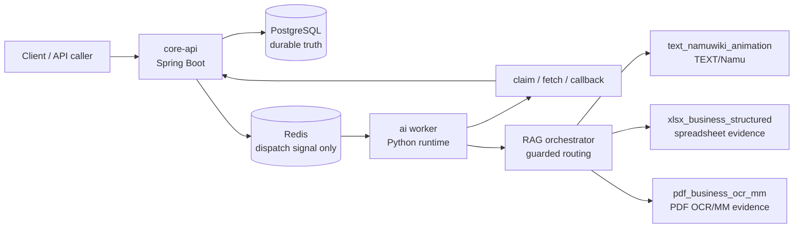

# Async AI Document Pipeline with Domain RAG

Spring Boot `core-api`와 Python `ai` worker를 분리한 비동기 문서 AI 처리 파이프라인입니다. 현재 이 저장소의 핵심은 하나의 통합 RAG 점수가 아니라, TEXT/XLSX/PDF를 분리한 3트랙 RAG 아키텍처와 diagnostic-only metric gate입니다.

PostgreSQL은 job, artifact, catalog, SearchUnit 상태의 durable truth입니다. Redis는 worker를 깨우는 dispatch signal로만 사용하며, worker는 실행 전 `core-api` claim을 통해 작업 소유권을 확보합니다.

## 현재 상태

기준 시점: 2026-05-17 KST. 전체 상태는 `official_denominator_source_bound_index_build_ready_load_checked`입니다. official answer/citation denominator는 열려 있고 첫 baseline은 29개 row가 채점됐지만, production promotion과 model-quality tuning은 여전히 닫혀 있습니다. 다음 agentic-loop measurement는 별도 run id로 실행됐고, source-bound official-denominator SearchUnit index는 비프로덕션 경로에서 빌드/load-check까지 통과했습니다.

| Metric surface | 현재 값 | 의미 |
|---|---:|---|
| Official metric input rows | TEXT `6`, XLSX `19`, PDF `4` | registry-backed answer/citation denominator 총 `29` |
| Official first-run baseline | PASS `8/29` | immutable baseline for comparison |
| Agentic-loop measurement | PASS `1/29`, scored `29/29` | diagnostic only: fixture-all/noop/chunk-only citations, not final comparable model-quality performance |
| Cross-track averages | `false` | TEXT/XLSX/PDF 평균값을 만들지 않음 |
| Promotion evidence | `false` | production promotion 증거로 쓰지 않음 |
| Official denominator registry mutation | `false` | denominator registry 변경 없음 |
| Production vector/index mutation | `false` | production namespace, vector, index write 없음 |
| Route/fallback labels | diagnostic-only | route accuracy, fallback success는 아직 official metric 아님 |

## RAG Answer/Citation Metric Baseline

The current official first-run baseline is `official_answer_citation_metric_first_run_v1`.
Its status is `SCORED_BASELINE_PARTIAL`: `scored_count=29`, `PASS=8`,
`CITATION_UNSUPPORTED=11`, and `PARTIAL_OR_UNSUPPORTED=10`.
This artifact is the immutable baseline for comparison.

Report-only candidates are not the baseline. The XLSX runtime candidate is
`PASS=26/29` all-track carry-forward with `XLSX=19/19`, report-only. The PDF table/value candidate is `PASS=29/29`, report-only. Candidate `PASS=29/29`
must not be presented as the official first-run baseline or promotion evidence.

expected answers/supporting evidence are for scoring/audit only and must not be used for generation, retrieval, citation selection, repair, threshold tuning, or winner selection.

The next phase is a separate actual performance measurement with a new run id,
`official_answer_citation_agentic_loop_run_v1`, and the implemented agentic loop
included. The non-production index at `ai/eval/indexes/rag-data` was rebuilt in
WSL2 with Python 3.12, CUDA PyTorch, and CUDA FAISS: embedding ran on `cuda:0`
and FAISS build metadata records `faiss_gpu_used=true`. The run scored 29 rows
with PASS=1, CITATION_UNSUPPORTED=25, and PARTIAL_OR_UNSUPPORTED=3. It remains
separate from the immutable baseline and is not promotion evidence.

Row-level attribution classifies that PASS=1/29 run as
`diagnostic_live_generation_fixture_all_index_not_official_denominator_representative`.
It used the fixture-all smoke index, `llm_backend=noop`, extractive snippet
generation, and chunk-only citation locators, so it is not final comparable
model-quality performance. `baseline_comparison_is_model_quality_comparable=false`.

The source-bound official-denominator SearchUnit export/build entrypoint is now
implemented for the non-production target
`ai/eval/indexes/rag-data-official-denominator-v1`, and the live runner has
canonical SearchUnit citation payload wiring plus explicit XLSX/PDF
source-bound adapter opt-in flags. Readiness is now
`BUILD_READY_LOAD_CHECK_PASSED`: the target index contains 29/29 official rows
with track counts PDF=4, TEXT=6, XLSX=19, plus `faiss.index`, `build.json`,
`ingest_manifest.json`, and `search_unit_manifest.jsonl`. TEXT rows come only
from `namu-v4-structured-combined/rag_chunks.jsonl`, XLSX rows from read-only
source workbooks, and PDF row/column locators from original PDFs/native text
with PaddleOCR reserved as the OCR fallback. Report-only XLSX/PDF candidate
artifacts must not be used as generation source.

Answer/citation silver strategy is now recorded in
`ai/eval/silver/answer_citation_silver_manifest_v1.json`, with readiness in
`ai/eval/silver/answer_citation_silver_readiness_v1.json`. Its purpose is an
anti-overfit generalization guard before later tuning against the small official
29-row denominator. The boundary is explicit: silver is not gold, not official
denominator, not promotion evidence, and not used for generation. expected
values are audit-only, candidate result rows are not silver generation source,
and official 29 query_ids are excluded from dev/holdout tuning silver. Initial
source-bound silver JSONL files were blocked rather than fabricated:
TEXT=0, XLSX=0, PDF=0. The official-denominator source-bound index and
canonical SearchUnit citation payload wiring are now available, but 29/29
source-bound SearchUnits overlap the official denominator. Safe non-official
source-bound source manifests are still missing, so silver generation stays
closed until coverage is settled.

Canonical source-of-truth artifacts:

- `docs/rag-ingestion-progress.md`
- `docs/rag-ingestion-measurements.md`
- `docs/rag-ingestion-triage.md`
- `ai/eval/reports/rag-ingestion/baseline_v1.json`
- `ai/eval/reports/rag-ingestion/scorer_v1.jsonl`
- `ai/eval/reports/rag-ingestion/metric_input_v1.json`
- `ai/eval/reports/rag-ingestion/smoke_v1.json`
- `ai/eval/reports/rag-ingestion/xlsx_candidate_v1.jsonl`
- `ai/eval/reports/rag-ingestion/pdf_candidate_v1.jsonl`
- `ai/eval/reports/rag-ingestion/source_bound_readiness_v1.json`
- `ai/eval/reports/rag-ingestion/status.jsonl`
- `ai/eval/silver/answer_citation_silver_manifest_v1.json`
- `ai/eval/silver/answer_citation_silver_readiness_v1.json`
- `ai/eval/eval_queries/official_denominator_registry.json`

Historical generated report payloads are not kept in the repo root. When needed
for local forensic review, use the external runtime archive under
`D:\_external_runtime_artifacts\async-ocr-rag-multimodal-pipeline\rag-ingestion\`.

## 3트랙 아키텍처

| Track | 범위 | Retrieval/evidence contract |
|---|---|---|
| `text_namuwiki_animation` | Namuwiki animation-domain TEXT RAG | 별도 TEXT denominator, source-bound answer/citation review, NAMU license guard |
| `xlsx_business_structured` | Business spreadsheet structured RAG | sheet, table, range, row, column, matched cells, citation locator, hidden/excluded-row guard |
| `pdf_business_ocr_mm` | Business PDF OCR/MM RAG | page, bbox, region, matched text, nearby paragraphs, OCR/native-text trust, FILE vs CONTENT lane separation |

이 세 트랙은 하나의 namespace, retrieval contract, denominator, quality average로 합치지 않습니다.

## XLSX/PDF Evidence 검색을 쉽게 보면

이 저장소에서 `Evidence`는 "답이 맞아 보인다"가 아니라 "어느 표, 어느 셀, 어느 페이지, 어느 문단을 근거로 삼았는지 남길 수 있다"에 가깝습니다. 그래서 XLSX와 PDF를 한 검색통에 넣고 점수만 비교하지 않습니다. 먼저 질문과 source metadata로 트랙을 고르고, 그 트랙 안에서만 후보를 찾은 뒤, 답에 붙일 근거 조각을 따로 조립합니다.

검색 흐름은 단순하게 보면 두 단계입니다.

1. 후보를 찾습니다. 이 질문이 어느 표나 페이지 근처에서 풀릴 가능성이 큰지 SearchUnit을 고릅니다.
2. 근거를 조립합니다. 후보를 찾았다는 사실만으로 끝내지 않고, 사람이 다시 확인할 수 있는 위치와 주변 문맥을 `Evidence`로 묶습니다.

- XLSX는 workbook을 다시 열어 숨김 셀을 새로 뒤지지 않습니다. 이미 검색된 `Evidence`에 남아 있는 sheet, table/range, matched cells, row/column, nearby row 같은 단서만 사용합니다. 표 구조나 행/열 단서가 부족하면 "아직 답의 근거로 쓰기엔 불완전하다"고 보고 diagnostic-only로 막습니다.
- PDF는 page, bbox, 영역 유형, matched text, section heading, nearby paragraph, OCR confidence 같은 단서를 봅니다. 페이지 위치나 주변 문맥이 부족하면 PDF도 official 근거로 올리지 않고 diagnostic-only로 남깁니다.

현재 POC 검색기는 후보를 조금 넓게 가져온 뒤 후처리로 걸러내는 구조입니다. 그래서 production promotion 전에 tenant/ACL, source type, parser, index, embedding 상태가 검색 랭킹 전이나 랭킹 내부에서 fail-closed로 검증되어야 합니다.

## 현재 트랙별 Metric

| Track | 현재 상태 | Diagnostic preview | Official state | 남은 blocker |
|---|---|---:|---|---|
| TEXT/Namu V2.1 | Official first-run PASS=6/6 | registry-backed answer/citation rows `6`; source-bound readiness resolves 6/6 from corpus chunks | agentic-loop run scored 6/6, PASS=0 | No TEXT blocker remains for source-bound readiness; no tuning or promotion. |
| XLSX | Official first-run PASS=1/19; runtime candidate report-only PASS=19/19 | registry-backed answer/citation rows `19`; source-bound readiness resolves 19/19 from source workbooks | agentic-loop run scored 19/19, PASS=0 | No XLSX blocker remains for source-bound readiness; candidate artifacts stay report-only, no winner selection. |
| PDF | Official first-run PASS=1/4; table/value candidate report-only PASS=4/4 | registry-backed answer/citation rows `4`; source-bound manifest rows `4/4` | agentic-loop run scored 4/4, PASS=1 | Source-field blocker cleared; do not treat candidate PASS=29/29 as baseline or promotion evidence. |

Route/fallback review artifact는 diagnostic analysis에만 사용합니다. routing accuracy, wrong-route rate, fallback success, multi-route success를 official metric으로 열지 않습니다.

## Metric 해석 경계

- Diagnostic PASS or preview counts do not mean production promotion.
- Silver, local LLM, and report-only results are not human-gold accuracy.
- TEXT, XLSX, and PDF denominators must remain separate.
- XLSX hidden/excluded content must stay out of query, candidate, answer, citation, debug-public, and official-denominator surfaces.
- PDF CONTENT evidence and FILE/document identity are separate lanes.

## 근거 문서

- `docs/rag-ingestion-progress.md`
- `ai/eval/reports/rag-ingestion/baseline_v1.json`
- `ai/eval/eval_queries/official_denominator_registry.json`

## 라이선스

이 저장소의 직접 작성 코드와 문서는 [`LICENSE`](LICENSE)의 Apache License 2.0을 따릅니다.

외부에서 수집한 PDF, XLSX, 이미지, OCR/MM annotation, 폰트, 공공데이터, Hugging Face dataset mirror, NamuWiki metadata 등은 이 저장소의 Apache-2.0 라이선스로 재허가되지 않습니다. 원천별 이용조건과 현재 내부 diagnostic usage gate는 [`docs/THIRD_PARTY_DATA_LICENSES.md`](docs/THIRD_PARTY_DATA_LICENSES.md)를 확인하세요.
