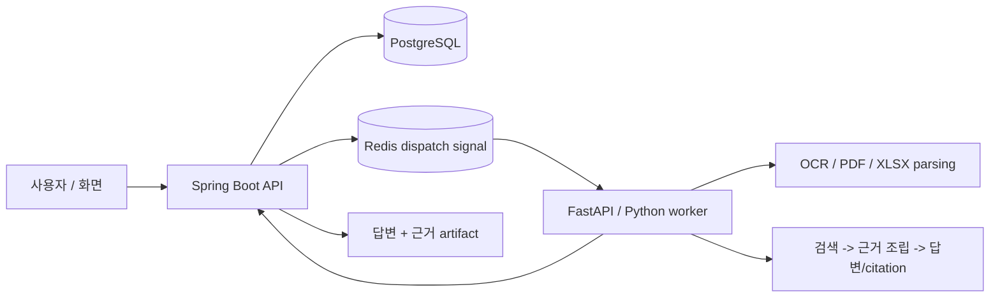

# 문서 근거 기반 AI 검색·답변 파이프라인

PDF, 엑셀, 텍스트 문서를 읽고 질문에 답하는 AI 문서 처리 시스템입니다.
단순히 답변만 생성하는 것이 아니라, **그 답변이 어떤 원문 근거에서 나왔는지** PDF 페이지, 엑셀 셀, 텍스트 조각 단위로 함께 보여주는 것을 목표로 합니다.

Spring Boot API, FastAPI 기반 AI worker, PostgreSQL, Redis, React/Vite를 사용해 백엔드, AI 처리, 비동기 작업, 검색/근거 추적, 화면까지 구성했습니다.

## 한눈에 보기

| 항목 | 내용 |
|---|---|
| 프로젝트 성격 | AI 문서 검색·질의응답 파이프라인 |
| 처리 문서 | TEXT, PDF, XLSX |
| 핵심 기능 | 문서 파싱, OCR, 검색, RAG 답변 생성, 근거 citation 표시 |
| 주요 기술 | Spring Boot, FastAPI, Python, PostgreSQL, Redis, FAISS, React |
| 강조점 | 오래 걸리는 AI 작업을 비동기 job으로 처리하고, 답변의 원문 근거를 추적 가능하게 만든 구조 |

## 왜 만들었나

AI 문서 검색에서 가장 큰 문제는 답변이 그럴듯해 보여도 **어떤 원문을 근거로 답했는지 확인하기 어렵다**는 점입니다.
이 프로젝트는 그 문제를 줄이기 위해 다음 흐름을 구현했습니다.

1. 사용자가 문서를 등록하거나 질문을 보냅니다.
2. 오래 걸리는 OCR, PDF/XLSX 파싱, 검색 작업은 별도 job으로 처리합니다.
3. AI worker가 문서 내용을 분석하고 검색 가능한 단위로 정리합니다.
4. 질문이 들어오면 관련 원문을 찾고 답변을 생성합니다.
5. 최종 결과에는 답변뿐 아니라 PDF page, XLSX sheet/range/cell, TEXT chunk 같은 근거 위치를 함께 제공합니다.

핵심은 **답변 생성**보다 **답변을 검증할 수 있는 근거 연결**입니다.

## 이 프로젝트에서 확인할 수 있는 역량

| 구분 | 구현 내용 |
|---|---|
| 백엔드 설계 | Spring Boot 기반 API, job 생성/조회, artifact 조회, document catalog, index 관리 endpoint 구현 |
| 비동기 처리 | 긴 OCR/RAG 작업을 request/response에 묶지 않고 Redis signal과 worker job으로 분리 |
| AI 파이프라인 | FastAPI/Python worker에서 OCR, PDF parsing, XLSX 구조 추출, retrieval, RAG 응답 처리 |
| 데이터 관리 | PostgreSQL을 작업 상태와 결과 저장의 기준점으로 사용하고, Redis는 dispatch signal 용도로 제한 |
| 근거 추적 | TEXT/PDF/XLSX 문서 유형별로 다른 evidence 구조를 분리하고 citation으로 표시 |
| 검증 구조 | answer/citation scorer, retrieval smoke metric, diagnostic-only 결과와 promotion evidence 구분 |
| 프론트엔드 | React/Vite 기반 작업 목록, 상태 timeline, 결과 preview 화면 구성 |

## 실제로 처리한 질문과 응답

아래 표는 대표 성능 지표가 아니라, 이 프로젝트가 **질문 → 원문 근거 찾기 → 답변 생성** 흐름을 실제로 어떻게 처리하는지 보여주는 샘플입니다.

| 문서 유형 | 실제 질문 | 확인한 근거 위치 | 응답 |
|---|---|---|---|
| PDF | 2020년 한국 원달러 기말 환율은 얼마인가요? | PDF page citation: 최근경제동향 PDF p.65 | 2020년 한국 원달러 기말 환율은 1,088.0입니다. |
| PDF | 2024년 수출입차 금액은 얼마인가요? | PDF page citation: 최근경제동향 PDF p.61 | 2024년 수출입차 금액은 6,836.1입니다. |
| XLSX | 2019년 2월 5호선의 승차총승객수는 몇 명입니까? | XLSX sheet/range/cell: 철도 sheet, D352 | 2019년 2월 5호선의 승차총승객수는 15,446,522명입니다. |
| XLSX | 2020년 11월에 지정된 하얀민들레노인요양원의 우편번호는 무엇입니까? | XLSX sheet/range/cell: 일반현황 sheet, C702 | 2020년 11월에 지정된 하얀민들레노인요양원의 우편번호는 41786입니다. |
| XLSX | 2014년 12월에 지정된 해뜨는요양원2의 시도 시군구 법정동명은 무엇입니까? | XLSX sheet/range/cell: 일반현황 sheet, G752 | 해뜨는요양원2의 시도 시군구 법정동명은 대구광역시 북구 복현동입니다. |
| TEXT | 미츠하는 타키를 만나려고 어디로 향했어 | TEXT chunk/source context | 미츠하는 타키를 실제로 만나기 위해 도쿄로 향했습니다. |
| TEXT | 유우야키의 나이와 생일은 어떻게 적혀 있어 | TEXT chunk/source context | 유우야키의 나이는 16세이고 생일은 9월 29일입니다. |

더 많은 샘플과 XLSX display-value/cell-range 진단 결과는 [Evaluation harness samples](ai/eval/README.md)에 분리했습니다.

## 기술적으로 신경 쓴 점

| 문제 | 해결 방식 |
|---|---|
| OCR, RAG, indexing은 시간이 오래 걸림 | API 응답 안에서 처리하지 않고 job pipeline으로 분리 |
| AI 답변은 근거가 불명확할 수 있음 | 답변에 사용된 원문 evidence를 별도 구조로 관리하고 citation으로 표시 |
| PDF, XLSX, TEXT는 근거의 형태가 다름 | 문서 유형별 evidence contract를 분리 |
| 검색 후보와 실제 citation 근거가 섞일 수 있음 | SearchView와 SourceAtom을 분리해 retrieval candidate와 citation truth를 구분 |
| 실험 결과가 운영 기준처럼 보일 수 있음 | diagnostic-only 결과, promotion evidence, production promotion을 명확히 구분 |

## 주요 개념을 쉽게 풀면

| 용어 | 이 프로젝트에서의 의미 |
|---|---|
| OCR | 이미지나 스캔 문서에서 글자를 읽어내는 작업 |
| RAG | 질문과 관련된 문서 내용을 먼저 찾고, 그 내용을 바탕으로 답변하는 방식 |
| Evidence | 답변의 근거가 되는 원문 단위 |
| Citation | 사용자가 확인할 수 있도록 표시한 근거 위치 |
| SearchView | 빠르게 검색하기 위한 후보 데이터 |
| SourceAtom | 실제 citation의 기준이 되는 원문 근거 단위 |
| EvidenceBundle | 답변 생성과 citation 표시에 필요한 근거 묶음 |

FAISS/vector index metadata는 검색 후보를 찾는 데만 사용합니다.
최종 citation의 기준은 SourceAtom/source registry에서 가져옵니다.
Expected answer, supporting evidence, gold fields는 답변 생성 source로 사용하지 않습니다.

## Current RAG Diagnostic Status

- Current RAG status: `V4_7_7_V3_LEGACY_ARCHIVE_RUNNER_CONSOLIDATION_NONPROD_READY`.
- Phase: v4_7 remains pre-official. `v4_7_7_v3_legacy_archive_and_runner_consolidation` is cleanup/refactor only and writes `ai/eval/reports/rag-ingestion/runs/v4_7_7/report.json`; it does not replay retrieval, EvidenceBundle, or answer generation.
- Resolver wiring: use `current` or `v4_7_7` for the latest archive-aware cleanup report, `v4_7_6` for the previous archive purge report, and short lineage keys `v4_7_preofficial`, `v4_7_2`, `v4_7_3`, `v4_7_4`, and `v4_7_5` for preserved current-profile provenance.
- v3 legacy artifact policy: generated v3 report artifacts are now classified in `ai/eval/reports/rag-ingestion/runs/v4_7_7/v3_legacy_artifact_manifest.jsonl` as externally archived/removed, deleted, or explicit holds with reasons. Counters are total 279, archived/removed 98, deleted 0, held 181 (current test/doc contract 133, documented review packet 16, ambiguous generated surface 32), unclassified 0.
- Runner consolidation: `ai/scripts/rag_eval.py` is the stable short-key runner. It owns `current`, `v4_7_7`, `v4_7_6`, and safe legacy check aliases `v3_21` and `v3_22`; unverified legacy diagnostic entrypoints remain explicit holds rather than being silently folded.
- v4_7 lineage preserved: v4_7_2 supersedes the abstract v4_7_1 Korean review packet with source-grounded Korean query candidates, hydrated rows 204, PDF 100, XLSX 104, and non-empty `질의문` 204; v4_7_3 applies the user-reviewed Korean query candidate CSV with `미검수=통과`; v4_7_4 replays PDF survivor 58 rows only; v4_7_5 repairs the PDF survivor EvidenceBundle diagnostic window.
- Rolling evidence docs: `docs/rag-ingestion-progress.md`, `docs/rag-ingestion-measurements.md`, and `docs/rag-ingestion-triage.md` remain the canonical human-readable status ledgers; no per-run Markdown is created.
- Hard boundary: not official metric, not gold/qrels, not relevance/answerability labels, not expected answer/evidence approval, not product-success evidence, not promotion evidence, not FT-A execution, not fine_tuning, not actual fine-tuning/training, not threshold tuning, not winner selection, not training data, and not live DB/index/cache readiness. Locked flags remain `official_metric=false`, `official_metric_input_rows=0`, `promotion_evidence=false`, `product_success_evidence_allowed=false`, `ft_a_execution=false`, `fine_tuning=false`, `fine_tuning_executed=false`, and `live_db_index_cache_readiness=false`.


## 전체 구조



## 구성 요소

| 영역 | 구현 내용 |
|---|---|
| API | job 생성/조회, artifact 조회, document catalog, SearchUnit indexing, index build/eval/promote/rollback endpoint |
| Worker | FastAPI task endpoint, Redis consumer, callback delivery, capability registry |
| OCR/PDF/XLSX | Tesseract/PaddleOCR 옵션, PDF text/table 처리, XLSX workbook 기반 구조 추출 |
| RAG | SearchUnit/SearchView 기반 indexing, source-family별 evidence assembly, citation verification |
| Eval | answer/citation scorer, retrieval smoke metric, silver/gold boundary guard |
| UI | 작업 목록, 상태 timeline, 결과 preview 중심의 React/Vite 화면 |

## 폴더 구조

| 경로 | 역할 |
|---|---|
| [`core-api/`](core-api/) | Spring Boot API 서버 |
| [`ai/app/`](ai/app/) | Python AI worker와 capability 구현 |
| [`ai/eval/`](ai/eval/) | RAG/OCR evaluation harness와 기준 데이터 |
| [`frontend/app/`](frontend/app/) | React/Vite UI |
| [`docker-compose.yml`](docker-compose.yml) | 로컬 PostgreSQL, Redis, 선택형 MinIO/LLM 인프라 |
| [`.env.example`](.env.example) | 로컬 실행 환경 변수 예시 |

- [Third-party data license notice](docs/THIRD_PARTY_DATA_LICENSES.md)

## 로컬 실행 메모

로컬 인프라는 기본적으로 PostgreSQL과 Redis를 띄웁니다.

```powershell
docker compose up -d
```

애플리케이션은 개발 중 디버깅을 쉽게 하기 위해 각각 로컬 프로세스로 실행하는 구조입니다.

- `core-api`: Java 21 / Maven / Spring Boot
- `ai`: Python / FastAPI / FAISS / sentence-transformers
- `frontend/app`: React / Vite / pnpm

대형 local corpus/runtime payload와 legacy root-level report artifacts는 repo 밖의 external runtime archive로 이동했습니다.
현재 pytest profile이 직접 읽는 `ai/eval/reports/rag-ingestion/`, `ai/eval/source_registry/`, `ai/eval/indexes/` generated evidence는 검증 경로 보존을 위해 local-only로 유지합니다.

진단 산출물 재검증은 원본 외부 manifest 경로를 README에 노출하지 않고 다음 명령으로 수행합니다.

```powershell
python -X utf8 -m py_compile ai\scripts\rag_v4_3_pdf_file_identity_confidence_and_evidence_window_split_nonprod.py
python -X utf8 -m py_compile ai\scripts\rag_v4_4_real_blind_ood_holdout_and_leakage_audit_nonprod.py
python -X utf8 -m py_compile ai\scripts\rag_v4_5_finetune_readiness_packet_nonprod.py
python -X utf8 -m py_compile ai\scripts\rag_v4_5_1_holdout_candidate_intake_gate_nonprod.py
python -X utf8 -m py_compile ai\scripts\rag_v4_5_2_external_holdout_candidate_source_identity_audit_nonprod.py
python -X utf8 -m py_compile ai\scripts\rag_v4_5_3_external_holdout_prior_source_identity_ledger_summary_nonprod.py
python -X utf8 -m py_compile ai\scripts\rag_v4_6_ft_route_policy_dry_run_preflight_nonprod.py
python -X utf8 -m py_compile ai\scripts\rag_v4_6_1_holdout_candidate_manifest_identity_contract_bridge_nonprod.py
python -X utf8 -m py_compile ai\scripts\rag_v4_6_2_ft_route_policy_fixture_contract_nonprod.py
python -X utf8 -m py_compile ai\scripts\rag_v4_6_3_ft_a_prompt_policy_baseline_schema_nonprod.py
python -X utf8 -m py_compile ai\scripts\rag_v4_6_4_ft_a_dry_run_input_manifest_validator_nonprod.py
python -X utf8 -m py_compile ai\scripts\rag_v4_6_5_ft_a_dry_run_execution_plan_gate_nonprod.py
python -X utf8 -m py_compile ai\scripts\rag_v4_6_6_holdout_gap_and_dry_run_blocker_ledger_nonprod.py
python -X utf8 -m py_compile ai\scripts\rag_v4_6_7_holdout_candidate_runtime_gate_parity_bridge_nonprod.py
python -X utf8 -m py_compile ai\scripts\rag_v4_6_8_runtime_readiness_dependency_freshness_gate_nonprod.py
python -X utf8 -m py_compile ai\scripts\rag_v4_6_9_holdout_candidate_duplicate_hygiene_gate_nonprod.py
python -X utf8 -m py_compile ai\scripts\rag_v4_6_10_external_holdout_candidate_manifest_gate_replay_nonprod.py
python -X utf8 -m py_compile ai\scripts\rag_v4_6_11_ft_a_runtime_input_validation_route_parity_nonprod.py
python -X utf8 -m py_compile ai\scripts\rag_v4_6_12_external_holdout_runtime_replay_route_parity_nonprod.py
python -X utf8 -m py_compile ai\scripts\rag_v4_7_preofficial_external_holdout_candidate_manifest_registration_nonprod.py
python -X utf8 -m py_compile ai\scripts\rag_v4_7_1_korean_review_packet_and_readme_status_snapshot_nonprod.py
python -X utf8 -m py_compile ai\scripts\rag_v4_7_2_source_grounded_korean_query_review_packet_hydration_nonprod.py
python -X utf8 -m py_compile ai\scripts\rag_v4_7_3_human_reviewed_korean_query_candidate_pass_exclusion_application_nonprod.py
python -X utf8 -m py_compile ai\scripts\rag_v4_7_4_pdf_survivor_retrieval_evidence_answer_quality_replay_nonprod.py
python -X utf8 -m py_compile ai\scripts\rag_eval.py
python -X utf8 ai\scripts\rag_v4_7_preofficial_external_holdout_candidate_manifest_registration_nonprod.py --check --candidate-manifest <external-candidate-manifest-jsonl>
python -X utf8 ai\scripts\rag_v4_3_pdf_file_identity_confidence_and_evidence_window_split_nonprod.py --check
python -X utf8 ai\scripts\rag_v4_4_real_blind_ood_holdout_and_leakage_audit_nonprod.py --check
python -X utf8 ai\scripts\rag_v4_5_finetune_readiness_packet_nonprod.py --check
python -X utf8 ai\scripts\rag_v4_5_1_holdout_candidate_intake_gate_nonprod.py --check
python -X utf8 ai\scripts\rag_v4_5_2_external_holdout_candidate_source_identity_audit_nonprod.py --check
python -X utf8 ai\scripts\rag_v4_5_3_external_holdout_prior_source_identity_ledger_summary_nonprod.py --check
python -X utf8 ai\scripts\rag_v4_6_ft_route_policy_dry_run_preflight_nonprod.py --check
python -X utf8 ai\scripts\rag_v4_6_1_holdout_candidate_manifest_identity_contract_bridge_nonprod.py --check
python -X utf8 ai\scripts\rag_v4_6_2_ft_route_policy_fixture_contract_nonprod.py --check
python -X utf8 ai\scripts\rag_v4_6_3_ft_a_prompt_policy_baseline_schema_nonprod.py --check
python -X utf8 ai\scripts\rag_v4_6_4_ft_a_dry_run_input_manifest_validator_nonprod.py --check
python -X utf8 ai\scripts\rag_v4_6_5_ft_a_dry_run_execution_plan_gate_nonprod.py --check
python -X utf8 ai\scripts\rag_v4_6_6_holdout_gap_and_dry_run_blocker_ledger_nonprod.py --check
python -X utf8 ai\scripts\rag_v4_6_7_holdout_candidate_runtime_gate_parity_bridge_nonprod.py --check
python -X utf8 ai\scripts\rag_v4_6_8_runtime_readiness_dependency_freshness_gate_nonprod.py --check
python -X utf8 ai\scripts\rag_v4_6_9_holdout_candidate_duplicate_hygiene_gate_nonprod.py --check
python -X utf8 ai\scripts\rag_v4_6_10_external_holdout_candidate_manifest_gate_replay_nonprod.py --check
python -X utf8 ai\scripts\rag_v4_6_11_ft_a_runtime_input_validation_route_parity_nonprod.py --check
python -X utf8 ai\scripts\rag_v4_6_12_external_holdout_runtime_replay_route_parity_nonprod.py --check
python -X utf8 ai\scripts\rag_v4_7_1_korean_review_packet_and_readme_status_snapshot_nonprod.py --check
python -X utf8 ai\scripts\rag_v4_7_2_source_grounded_korean_query_review_packet_hydration_nonprod.py --check
python -X utf8 ai\scripts\rag_v4_7_3_human_reviewed_korean_query_candidate_pass_exclusion_application_nonprod.py --check
python -X utf8 ai\scripts\rag_v4_7_4_pdf_survivor_retrieval_evidence_answer_quality_replay_nonprod.py --check
python -X utf8 ai\scripts\rag_eval.py v4_7_5 --check
```

## 라이선스와 외부 데이터

이 저장소의 직접 작성 코드와 문서는 [Apache License 2.0](LICENSE)을 따릅니다.

단, 외부에서 수집한 PDF, XLSX, 이미지, OCR/MM annotation, 폰트, 공공데이터, Hugging Face dataset mirror, NamuWiki metadata 등은 이 저장소의 Apache-2.0 라이선스로 재허가되지 않습니다.
원천별 이용조건과 현재 내부 diagnostic usage gate는 [Third-party data license notice](docs/THIRD_PARTY_DATA_LICENSES.md)를 확인하세요.
