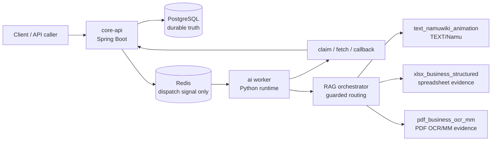

# Async AI Document Pipeline with Domain RAG

Spring Boot `core-api`와 Python `ai` worker를 분리한 비동기 문서 AI 처리 파이프라인입니다. 현재 이 저장소의 핵심은 하나의 통합 RAG 점수가 아니라, TEXT/XLSX/PDF를 분리한 3트랙 RAG 아키텍처와 diagnostic-only metric gate입니다.

PostgreSQL은 job, artifact, catalog, SearchUnit 상태의 durable truth입니다. Redis는 worker를 깨우는 dispatch signal로만 사용하며, worker는 실행 전 `core-api` claim을 통해 작업 소유권을 확보합니다.

## 현재 상태

기준 시점: 2026-05-14 KST. 전체 상태는 `diagnostic_pipeline_ready_for_review`이고, production promotion과 model-quality tuning은 아직 blocked입니다. 현재 metric preflight는 `DIAGNOSTIC_PREFLIGHT_BLOCKED`이며, official metric과 official denominator는 아직 열지 않았습니다.

| Metric surface | 현재 값 | 의미 |
|---|---:|---|
| Official metric input rows | TEXT `0`, XLSX `0`, PDF `0` | 세 트랙 모두 official metric 입력은 닫혀 있음 |
| Cross-track averages | `false` | TEXT/XLSX/PDF 평균값을 만들지 않음 |
| Promotion evidence | `false` | production promotion 증거로 쓰지 않음 |
| Official denominator registry mutation | `false` | denominator registry 변경 없음 |
| Production vector/index mutation | `false` | production namespace, vector, index write 없음 |
| Route/fallback labels | diagnostic-only | route accuracy, fallback success는 아직 official metric 아님 |

## 3트랙 아키텍처

| Track | 범위 | Retrieval/evidence contract |
|---|---|---|
| `text_namuwiki_animation` | Namuwiki animation-domain TEXT RAG | 별도 TEXT denominator, source-bound answer/citation review, NAMU license guard |
| `xlsx_business_structured` | Business spreadsheet structured RAG | sheet, table, range, row, column, matched cells, citation locator, hidden/excluded-row guard |
| `pdf_business_ocr_mm` | Business PDF OCR/MM RAG | page, bbox, region, matched text, nearby paragraphs, OCR/native-text trust, FILE vs CONTENT lane separation |

이 세 트랙은 하나의 namespace, retrieval contract, denominator, quality average로 합치지 않습니다.

## XLSX/PDF Evidence 검색을 쉽게 보면

이 저장소에서 `Evidence`는 "답이 맞아 보인다"가 아니라 "어느 표, 어느 셀, 어느 페이지, 어느 문단을 근거로 삼았는지 남길 수 있다"에 가깝습니다. 그래서 XLSX와 PDF를 한 검색통에 넣고 점수만 비교하지 않습니다. 먼저 질문과 source metadata로 트랙을 고르고, 그 트랙 안에서만 후보를 찾은 뒤, 답에 붙일 근거 조각을 따로 조립합니다.

검색 흐름은 단순하게 보면 두 단계입니다.

1. 후보를 찾습니다. 이 질문이 어느 표나 페이지 근처에서 풀릴 가능성이 큰지 SearchUnit을 고릅니다.
2. 근거를 조립합니다. 후보를 찾았다는 사실만으로 끝내지 않고, 사람이 다시 확인할 수 있는 위치와 주변 문맥을 `Evidence`로 묶습니다.

- XLSX는 workbook을 다시 열어 숨김 셀을 새로 뒤지지 않습니다. 이미 검색된 `Evidence`에 남아 있는 sheet, table/range, matched cells, row/column, nearby row 같은 단서만 사용합니다. 표 구조나 행/열 단서가 부족하면 "아직 답의 근거로 쓰기엔 불완전하다"고 보고 diagnostic-only로 막습니다.
- PDF는 page, bbox, 영역 유형, matched text, section heading, nearby paragraph, OCR confidence 같은 단서를 봅니다. 페이지 위치나 주변 문맥이 부족하면 PDF도 official 근거로 올리지 않고 diagnostic-only로 남깁니다.

현재 POC 검색기는 후보를 조금 넓게 가져온 뒤 후처리로 걸러내는 구조입니다. 그래서 production promotion 전에 tenant/ACL, source type, parser, index, embedding 상태가 검색 랭킹 전이나 랭킹 내부에서 fail-closed로 검증되어야 합니다.

## 현재 트랙별 Metric

| Track | 현재 상태 | Diagnostic preview | Official state | 남은 blocker |
|---|---|---:|---|---|
| TEXT/Namu V2.1 | `POLICY_REVIEW_PACKET_READY` | diagnostic positive denominator `47`; generated-answer review rows `66`; strict clean `60/66`; cleanup-inclusive `65/66`; citation-supported `65/66`; unresolved `1` | official metric input rows `0`; official answer/citation denominator `0`; model-assisted output is not human-approved gold | Human policy decision is required before any official metric lane can open |
| XLSX | retrieval/evidence strict silver ready, answer/citation preflight `FAIL` | official retrieval/evidence denominator `23`; strict silver rows `23`; live smoke Hit@10 `1.0`; MRR@10 `0.942`; citation accuracy `1.0`; answer-claim/citation-locator `23/23`; leakage count `14`; clean pass held at `0` | official metric input rows `0`; answer-generation denominator `0` | Hidden/excluded leakage reprobe must pass before clean preflight |
| PDF | `DIAGNOSTIC_ONLY_BLOCKED` | conservative positive controls `7`; strict silver rows `0`; diagnostic fallback rows `7`; matched text `7`; complete page/bbox/region `4`; citation locator `4`; strict gate readiness `0` | official metric input rows `0`; answer denominator `0` | Layout/SearchUnit/OCR/citation metadata must be enriched before strict gate rerun |

Route/fallback review artifact는 diagnostic analysis에만 사용합니다. routing accuracy, wrong-route rate, fallback success, multi-route success를 official metric으로 열지 않습니다.

## Metric 해석 경계

- Diagnostic PASS or preview counts do not mean production promotion.
- Silver, local LLM, and report-only results are not human-gold accuracy.
- TEXT, XLSX, and PDF denominators must remain separate.
- XLSX hidden/excluded content must stay out of query, candidate, answer, citation, debug-public, and official-denominator surfaces.
- PDF CONTENT evidence and FILE/document identity are separate lanes.

## 근거 문서

- `docs/rag-ingestion-progress.md`
- `ai/eval/reports/rag-ingestion/three_track_metric_preflight_board.md`
- `ai/eval/reports/rag-ingestion/three_track_orchestration_report.md`
- `ai/eval/eval_queries/official_denominator_registry.json`

## 라이선스

이 저장소의 직접 작성 코드와 문서는 [`LICENSE`](LICENSE)의 Apache License 2.0을 따릅니다.

외부에서 수집한 PDF, XLSX, 이미지, OCR/MM annotation, 폰트, 공공데이터, Hugging Face dataset mirror, NamuWiki metadata 등은 이 저장소의 Apache-2.0 라이선스로 재허가되지 않습니다. 원천별 이용조건과 현재 내부 diagnostic usage gate는 [`docs/THIRD_PARTY_DATA_LICENSES.md`](docs/THIRD_PARTY_DATA_LICENSES.md)를 확인하세요.
