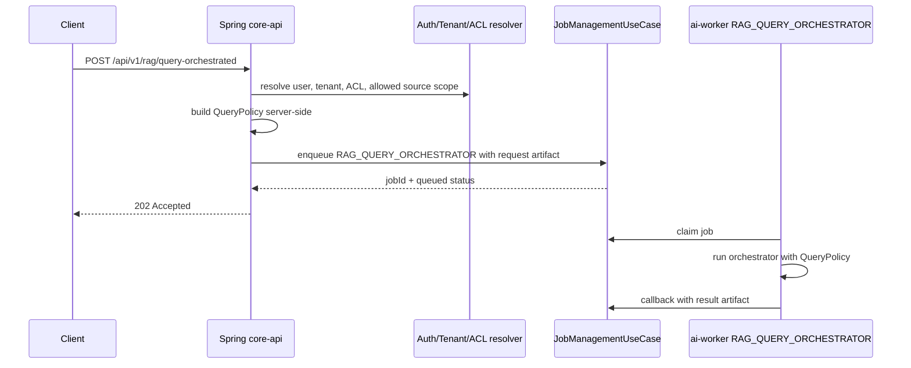

# RAG Query Orchestrator Endpoint Design Review

작성일: 2026-05-04

## Scope

이 문서는 `RAG_QUERY_ORCHESTRATOR`를 위한 optional Spring endpoint를 구현하기 전에 필요한 endpoint shape와 security/ACL 경계를 정리한다.

이번 작업은 design review이며 구현하지 않는다.

변경하지 않는 것:

- Spring controller 구현
- DB migration
- worker production route
- public endpoint default-on
- ingestion parser / SearchUnit indexing / eval gate
- LangChain 도입

기본 판단:

- Python orchestrator는 public endpoint가 아니다.
- Spring `core-api`가 인증, 인가, tenant, ACL, active index policy를 만든다.
- `QueryPolicy`는 Spring 또는 trusted server code가 만든다.
- LLM은 ACL, tenant, `index_version`, `source_file_type`, `parser_version`, `embedding_status` filter를 만들거나 신뢰 결정하지 않는다.
- endpoint는 기본 off 또는 internal-only로 시작해야 한다.

## Current Repo Context

현재 repo의 public-facing HTTP surface는 주로 다음이다.

- `core-api/src/main/java/com/aipipeline/coreapi/job/adapter/in/web/JobController.java`
- `core-api/src/main/java/com/aipipeline/coreapi/catalog/adapter/in/web/DocumentCatalogController.java`
- `core-api/src/main/java/com/aipipeline/coreapi/catalog/adapter/in/web/IndexBuildController.java`

중요한 현재 상태:

- `JobController` 주석은 authentication이 later phase로 deferred되어 있다고 명시한다.
- worker-facing endpoint는 `/api/internal/jobs/*`에 있고, 주석상 shared secret 또는 mTLS 필요성이 문서화되어 있다.
- `/api/v1/library/search`는 lexical diagnostic path이며 vector-grade production Evidence path가 아니다.
- `RAG_QUERY_ORCHESTRATOR` worker capability는 feature flag default-off로 등록될 수 있지만, 이것만으로 public endpoint readiness가 생기지는 않는다.

따라서 optional endpoint는 지금 바로 public으로 열기보다, security/tenant/ACL source of truth가 구현된 뒤 별도 PR로 여는 것이 맞다.

## Proposed Endpoint Shape

후보 endpoint:

```http
POST /api/v1/rag/query-orchestrated
Content-Type: application/json
```

권장 초기 운영 모드:

- default off: `AIPIPELINE_CORE_RAG_QUERY_ORCHESTRATOR_ENDPOINT_ENABLED=false`
- internal-only 또는 authenticated admin/test-only profile
- async job submission first
- no direct Python HTTP exposure

### Preferred Flow: Async Worker Job



Why async first:

- Reuses existing worker claim/callback lifecycle.
- Avoids long HTTP request timeouts during vector retrieval and answer synthesis.
- Keeps Python orchestrator off the public network.
- Makes auditability easier because request, policy snapshot, output artifact, and callback are persisted through existing job machinery.

### Alternative: Synchronous Internal Preview

A synchronous response could be useful for local demo, but it should be internal-only and not the first production path.

Reasons to defer sync:

- It encourages Spring to wait on worker execution.
- It needs stricter timeout, cancellation, and retry semantics.
- It can accidentally become a public answer endpoint before ACL and active index policy are complete.

## Request DTO Draft

Client request must be intent and scope hints only. It must not contain trusted filters.

```json
{
  "query": "매출 표와 PDF 설명을 함께 근거로 답해줘",
  "sourceTypes": ["PDF", "SPREADSHEET"],
  "topK": 8,
  "answerMode": "grounded_summary",
  "includeTrace": false,
  "scope": {
    "sourceFileIds": ["optional-source-file-id"],
    "collectionIds": ["optional-collection-id"]
  }
}
```

Field rules:

- `query`: required, nonblank, max length enforced by Spring.
- `sourceTypes`: optional user hint; Spring intersects it with server allowlist and user ACL. Empty after intersection is reject.
- `topK`: optional; Spring clamps to a server maximum.
- `answerMode`: optional enum; it does not relax evidence requirements.
- `includeTrace`: default false; if true, trace must be redacted.
- `scope`: optional bounded scope. Every id must be authorized for the resolved tenant/user before it can affect policy.

Client must not send these as trusted fields:

- `tenantId`
- `userId`
- `aclTags`
- `requiredIndexVersion`
- `allowedParserVersions`
- `requiredEmbeddingStatus`
- `activeIndexVersion`
- `diagnosticOnly`

If a future debug/admin DTO accepts a full `QueryPolicy`, it must be internal-only and must still be validated against server-derived context.

## Response DTO Draft

Preferred async response:

```json
{
  "requestId": "rq_...",
  "jobId": "job_...",
  "status": "QUEUED",
  "capability": "RAG_QUERY_ORCHESTRATOR",
  "mode": "async",
  "policy": {
    "requiredIndexVersion": "rag-ingestion-v2-active",
    "allowedSourceFileTypes": ["PDF", "SPREADSHEET"],
    "allowedParserVersions": ["pdf-extract-v2", "xlsx-extract-v2-hidden-safe"],
    "requiredEmbeddingStatus": "EMBEDDED",
    "topK": 8,
    "tenantScoped": true,
    "aclScoped": true
  },
  "links": {
    "job": "/api/v1/jobs/job_..."
  }
}
```

Completed result artifact shape, produced by worker and returned through existing job/artifact read path:

```json
{
  "requestId": "rq_...",
  "status": "answered|blocked|failed",
  "answer": "string",
  "citations": [
    {
      "evidenceId": "string",
      "citationText": "string",
      "sourceFileId": "string",
      "sourceFileType": "PDF",
      "location": {
        "pageNo": 2
      }
    }
  ],
  "usedEvidenceIds": ["ev_..."],
  "evidenceSummary": {
    "verifiedCount": 3,
    "rejectedCount": 2,
    "sourceTypeCounts": {
      "PDF": 2,
      "SPREADSHEET": 1
    }
  },
  "warnings": [],
  "stopReason": "answered_with_verified_evidence"
}
```

Do not return by default:

- raw full Evidence text for every candidate
- unbounded graph trace
- raw worker errors with stack traces
- hidden LLM reasoning
- ACL tags if they expose security model internals

## Spring-Created QueryPolicy

Spring/trusted server code must create `QueryPolicy`. The LLM and client request must not create it.

Required fields:

```json
{
  "requestId": "rq_...",
  "userId": "authenticated-user-id",
  "tenantId": "tenant-id",
  "aclTags": ["resolved", "server", "tags"],
  "requiredIndexVersion": "active-index-version",
  "allowedSourceFileTypes": ["PDF", "SPREADSHEET", "TEXT"],
  "allowedParserVersions": ["pdf-extract-v2", "xlsx-extract-v2-hidden-safe"],
  "requiredEmbeddingStatus": "EMBEDDED",
  "topK": 8
}
```

Server-owned derivation:

- `requestId`: generated by Spring.
- `userId`: resolved from authenticated principal.
- `tenantId`: resolved from authenticated principal/session/API key, not request body.
- `aclTags`: resolved from server-side authorization context.
- `requiredIndexVersion`: resolved from active promoted index or explicit safe internal config.
- `allowedSourceFileTypes`: server allowlist intersected with request hint and user scope.
- `allowedParserVersions`: server allowlist tied to safe parser contracts.
- `requiredEmbeddingStatus`: fixed to `EMBEDDED`.
- `topK`: clamped to server max.

Potential future fields:

- `sourceFileIds`
- `documentVersionIds`
- `collectionIds`
- `maxEvidence`
- `maxToolCalls`
- `traceLevel`

These future fields must also be server-derived or server-validated.

## Fail-Closed Conditions

Spring must reject before enqueue when any of these are true.

Auth / tenant:

- no authenticated principal
- no tenant context for production mode
- tenant id in request body attempts to override resolved tenant
- requested scope includes unauthorized source files or collections

ACL:

- no ACL context in production mode
- empty ACL after resolution when endpoint is not explicitly configured for public corpus
- source scope cannot be proven accessible
- ACL tags are supplied by client or LLM and not server-derived

Index:

- no active `requiredIndexVersion`
- requested index version differs from active production index, unless internal-only admin override is explicitly enabled
- active index has not passed promotion gate
- index health/readiness counters indicate mismatch, missing embedding records, or gate input missing

Source type:

- no allowed source file types after server allowlist intersection
- source type outside `PDF`, `SPREADSHEET`, `TEXT`
- request tries to use library-search diagnostic results as production Evidence

Parser version:

- no parser allowlist
- parser version not in server-approved list
- XLSX parser version does not preserve hidden policy contract such as `xlsx-extract-v2-hidden-safe`
- PDF/TEXT parser contract lacks required citation/location fields for the requested mode

Embedding:

- `requiredEmbeddingStatus != "EMBEDDED"`
- evidence returned from worker has non-EMBEDDED status
- evidence index version or parser version mismatch is found by worker verifier

Answer:

- no verified evidence
- evidence has missing `citation_text`
- evidence has missing or invalid `location_json`
- answer uses evidence ids outside verified set

All of the above are code-level conditions. They are not prompt instructions.

## Worker Capability Invocation

Recommended request artifact passed to worker:

```json
{
  "query": "string",
  "mode": "production",
  "policy": {
    "requestId": "rq_...",
    "userId": "server-user-id",
    "tenantId": "server-tenant-id",
    "aclTags": ["server-derived"],
    "requiredIndexVersion": "active-index-version",
    "allowedSourceFileTypes": ["PDF"],
    "allowedParserVersions": ["pdf-extract-v2"],
    "requiredEmbeddingStatus": "EMBEDDED",
    "topK": 8
  }
}
```

Invocation options:

1. Existing job queue
   - Add `RAG_QUERY_ORCHESTRATOR` to Spring job capability enum and validator only when endpoint implementation begins.
   - Store JSON request as an input artifact.
   - Enqueue via `JobManagementUseCase`.
   - Worker claims and runs the already feature-flagged capability.

2. Internal service-to-worker call
   - Not preferred for first production path.
   - Would require a new internal API surface and auth/mTLS/shared-secret design.

Worker must still verify:

- `retrieval_backend == "vector"`
- `index_version == policy.requiredIndexVersion`
- `embedding_status == "EMBEDDED"`
- source type in policy allowlist
- parser version in policy allowlist
- citation/location locators
- no answer if verified evidence is empty

Spring policy generation is necessary but not sufficient. Worker verification remains the second line of defense.

## Security Checklist Before Implementation

Endpoint exposure:

- Endpoint flag exists and defaults to false.
- Internal-only profile or authenticated route is enforced before any merge to default runtime.
- No Python public HTTP endpoint is added.
- Rate limit and request size limit are defined.

Authentication:

- Auth mechanism exists for `/api/v1/rag/query-orchestrated`.
- Principal cannot be absent in production mode.
- Service/admin override path is separate from user path.

Authorization / tenant:

- Tenant is resolved server-side.
- ACL tags or equivalent access policy are resolved server-side.
- Source file / collection scope is checked before enqueue.
- Response does not reveal unauthorized source ids, filenames, snippets, or citations.

Policy:

- Client cannot set trusted `QueryPolicy` fields.
- LLM cannot set trusted `QueryPolicy` fields.
- `requiredIndexVersion` comes from active promoted index.
- Parser allowlist is server config, not user input.
- `requiredEmbeddingStatus` is fixed to `EMBEDDED`.

Retrieval:

- Production path uses vector-backed evidence only.
- library-search remains diagnostic-only.
- Overfetch + post-filter is accepted only as POC, not as production-grade ACL enforcement.
- Production readiness requires pre-filter or dedicated safe retrieval API for tenant/ACL/index/source/parser filters.

Evidence / answer:

- Deterministic citation verifier is mandatory.
- XLSX aggregation is deterministic code, not LLM arithmetic.
- Answer synthesis receives only verified Evidence and deterministic aggregation results.
- No-evidence path returns refusal/clarification/fallback, not factual answer.

Audit / observability:

- Request id, user id, tenant id, index version, selected tools, verified/rejected counts are auditable.
- Full traces are redacted by default.
- Policy snapshot stored in job artifact must not leak secrets or raw ACL implementation internals.
- Security rejection reasons are structured but not overly revealing to the client.

Testing:

- flag off: endpoint absent or returns 404/disabled.
- unauthenticated: reject.
- no tenant: reject.
- missing ACL: reject.
- unauthorized source scope: reject.
- index mismatch: reject.
- parser mismatch: reject.
- source type mismatch: reject.
- library-search evidence cannot be used.
- no verified evidence blocks answer.
- existing `RAG`, `AGENT`, `AUTO`, `PDF_EXTRACT`, `XLSX_EXTRACT` tests remain unchanged.

## Why Implementation Should Stay Deferred

Endpoint implementation should be deferred until these are true.

Required entry conditions:

- Spring has a production authentication model for this endpoint.
- Tenant and ACL context source of truth is implemented and testable.
- Active index resolution is explicit and tied to promotion gate output.
- Spring can create `QueryPolicy` without trusting client or LLM filters.
- Worker vector wrapper has a safe retrieval API or proven pre-filter path for tenant/ACL/index/source/parser filtering.
- Response redaction and audit fields are defined.
- `RAG_QUERY_ORCHESTRATOR` job capability is supported in Spring enum/validator behind a feature flag.
- End-to-end tests cover unauthorized source leakage and no-evidence answer blocking.

Reasons not to implement now:

- Current `JobController` documents authentication as deferred.
- Current worker vector wrapper is POC overfetch + post-filter + verifier, not production-grade filter enforcement.
- `/api/v1/library/search` is lexical diagnostic and must not become a fallback Evidence source.
- Public endpoint without tenant/ACL would violate the orchestrator's core safety model.
- Adding the endpoint before safe retrieval filters risks creating an answer surface that appears production-ready while still relying on POC assumptions.

## Recommended Next PR Boundary

Do not implement `POST /api/v1/rag/query-orchestrated` yet.

Recommended next PR, when ready:

- docs + tests first for Spring policy builder behavior
- endpoint flag default false
- internal-only controller or disabled public route
- DTO validation only
- no synchronous answer generation
- enqueue `RAG_QUERY_ORCHESTRATOR` job only after auth/tenant/ACL policy is resolved

Still excluded:

- DB migration unless policy/audit model explicitly requires it
- LangChain
- ingestion parser changes
- SearchUnit indexing changes
- promotion/eval/gate bypass
