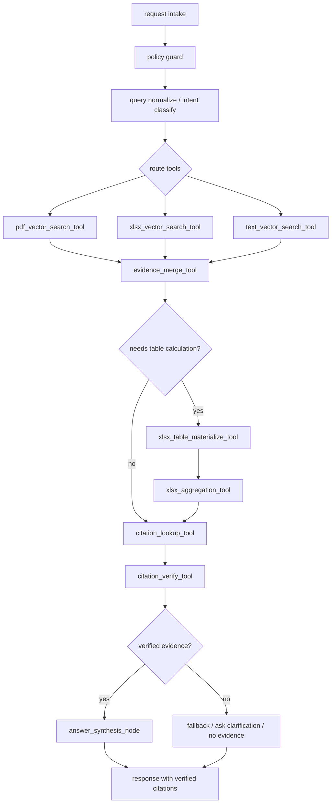

# RAG Query Orchestrator POC Plan

작성일: 2026-05-04

## Goal

PDF/XLSX/TEXT 검색 결과를 query-time에 유기적으로 조합하는 제한적 LangGraph POC를 설계한다. 이 POC는 ingestion core와 독립적으로 동작해야 하며, promotion/eval/gate를 우회하지 않는다.

기본 판단:

- LangGraph는 query-time orchestration에 한해 사용한다.
- LangChain은 POC에서 보류한다.
- vector-backed Evidence만 운영 후보로 본다.
- library-search는 diagnostic으로만 둔다.
- citation 검증과 XLSX aggregation은 deterministic code node로 둔다.

## Isolation Strategy

권장 격리 방식은 3단계다.

1. Unit-test-only graph skeleton
   - 새 module에서 fake tool과 fixture Evidence로 graph를 검증한다.
   - runtime endpoint 없음.
   - DB schema 변경 없음.

2. Feature-flagged worker capability
   - 예: `AIPIPELINE_WORKER_RAG_QUERY_ORCHESTRATOR_ENABLED=false`
   - 새 capability 이름 예: `RAG_QUERY_ORCHESTRATOR`
   - 기존 `RAG`, `AGENT`, `AUTO`, `PDF_EXTRACT`, `XLSX_EXTRACT` 동작은 변경하지 않는다.

3. Optional separate Spring endpoint
   - 예: `POST /api/v1/rag/query-orchestrated`
   - 기본 off.
   - 내부적으로 worker job/capability를 호출하거나, Python query service wrapper를 호출한다.
   - 이 단계는 security/ACL design이 명확해진 뒤 진행한다.

POC 첫 PR은 1단계에 머무는 것이 가장 안전하다.

## F. Candidate Query-Time Graph



### Node Responsibilities

`policy_guard`

- Resolves tenant/user/ACL context before any retrieval.
- Fixes required `index_version`.
- Builds allowlists for source file type and parser version.
- Rejects request if required filters are missing.

`query normalize / intent classify`

- Deterministic first pass.
- Optional LLM only for intent classification, never for filter trust.
- Output examples: `pdf_lookup`, `xlsx_lookup`, `xlsx_aggregation`, `text_lookup`, `mixed`.

`route tools`

- Chooses candidate tools from intent and explicit source-type needs.
- Conservative default can call all three vector tools with bounded `top_k`.

`evidence_merge_tool`

- Deduplicates by `search_unit_id`, then `chunk_id`, then stable source/unit key.
- Keeps vector backend identity and per-tool source.
- Does not synthesize facts.

`citation_verify_tool`

- Code-only verifier.
- Rejects evidence with missing citation/location/index/filter fields.
- Produces verification reasons.

`answer_synthesis_node`

- LLM or extractive generator can be used.
- Input is only verified Evidence and deterministic aggregation results.
- No direct DB/tool access.

## G. Tool Interface Draft

### Shared Types

```python
class QueryPolicy:
    request_id: str
    user_id: str | None
    tenant_id: str | None
    acl_tags: list[str]
    required_index_version: str
    allowed_source_file_types: list[str]
    allowed_parser_versions: list[str]
    required_embedding_status: str = "EMBEDDED"
    top_k: int = 10

class Evidence:
    evidence_id: str
    retrieval_backend: str
    rank: int
    scores: dict
    source: dict
    index: dict
    unit: dict
    content: dict
    location: dict
    policy: dict
    verification: dict
```

`QueryPolicy`는 LLM이 만들지 않는다. Spring auth/session 또는 feature-flagged test harness가 code path에서 만든다.

### pdf_vector_search_tool

Input:

```json
{
  "query": "string",
  "policy": {
    "required_index_version": "rag-ingestion-v2-candidate",
    "allowed_source_file_types": ["PDF"],
    "allowed_parser_versions": ["pdf-extract-v1", "pdf-extract-v2"],
    "required_embedding_status": "EMBEDDED",
    "top_k": 10
  }
}
```

Output:

```json
{
  "tool": "pdf_vector_search_tool",
  "evidence": [],
  "rejected": [],
  "backend_identity": {
    "backend": "faiss",
    "index_namespace_filter": "rag-ingestion-v2-candidate"
  }
}
```

Implementation note:

- Wrap existing Python `Retriever.retrieve()`.
- Post-filter Evidence by `source_file_type`, `parser_version`, `index_version`, `embedding_status`.
- POC에서는 post-filter로 시작하되, production 전에는 pre-filter 또는 dedicated safe retrieval API가 필요하다.

### xlsx_vector_search_tool

Same shape as PDF, but the current catalog/indexing source type should be treated as `["SPREADSHEET"]`. File extensions such as `.xlsx` and `.xlsm` are input-file validation details, not query-time SearchUnit source types. Parser version starts with `xlsx-extract-v2-hidden-safe`.

Additional verification:

- `hidden_policy_version == "exclude-hidden-v1"` when present
- `cellRange` exists for table/row evidence
- `sheetName` exists for sheet/table/row evidence

### text_vector_search_tool

Same shape, but source types are `["TEXT", "TXT", "MARKDOWN", "MD"]` where available. Current simple RAG corpus may not always carry SearchUnit v2 text source types, so POC should tolerate missing TEXT rows in fixtures and mark this as readiness status rather than inventing type labels.

### citation_lookup_tool

Input:

```json
{
  "evidence_refs": ["evidence_id"],
  "fields": ["citation_text", "location_json", "source_file_name"]
}
```

Output:

```json
{
  "citations": [
    {
      "evidence_id": "string",
      "citation_text": "string",
      "location_json": {},
      "source_file_name": "string"
    }
  ]
}
```

Implementation note:

- Prefer fields already present in Evidence.
- If lookup is needed, call bounded API by `search_unit_id` or `source_file_id + unit_key`.
- Do not allow arbitrary SQL or broad DB query.

### xlsx_table_materialize_tool

Input:

```json
{
  "table_ref": {
    "source_file_id": "string",
    "document_version_id": "string",
    "search_unit_id": "string|null",
    "sheet_name": "string",
    "cell_range": "A1:D20",
    "table_id": "string|null"
  },
  "limits": {
    "max_rows": 200,
    "max_columns": 50,
    "max_cells": 5000
  }
}
```

Output:

```json
{
  "table_ref": {},
  "headers": [],
  "rows": [],
  "truncated": false,
  "hidden_policy_version": "exclude-hidden-v1"
}
```

Implementation note:

- Deterministic.
- Hidden rows/cells remain excluded.
- Use cached formula values only.
- No macro evaluation.
- If table/cell metadata endpoint is not available yet, POC can use fixture-only materialization.
- Do not assume normalized `table_metadata` can always be directly joined back to the SearchUnit. Prefer Evidence `location_json` plus bounded lookup keys until that bridge is explicitly hardened.

### xlsx_aggregation_tool

Input:

```json
{
  "table": "materialized_table_ref",
  "operation": "sum|avg|min|max|count",
  "metric_column": "string",
  "group_by": ["string"],
  "filters": []
}
```

Output:

```json
{
  "operation": "sum",
  "result": [],
  "warnings": [],
  "deterministic": true
}
```

Implementation note:

- LLM may propose aggregation spec, but code validates allowed columns and operations.
- Ambiguous numeric/date parsing returns a warning or rejection, not an LLM guess.

### evidence_merge_tool

Input:

```json
{
  "evidence_batches": [],
  "strategy": "rank_rrf_then_type_balance",
  "max_evidence": 12
}
```

Output:

```json
{
  "merged_evidence": [],
  "dedupe_stats": {},
  "source_type_counts": {}
}
```

### citation_verify_tool

Input:

```json
{
  "evidence": [],
  "policy": {}
}
```

Output:

```json
{
  "verified": [],
  "rejected": [
    {
      "evidence_id": "string",
      "reason": "missing_location_json"
    }
  ],
  "metrics": {
    "verified_count": 0,
    "rejected_count": 0,
    "index_version_mismatch_count": 0,
    "embedding_status_mismatch_count": 0
  }
}
```

### answer_synthesis_node

Input:

```json
{
  "query": "string",
  "verified_evidence": [],
  "aggregation_results": [],
  "answer_policy": {
    "must_cite": true,
    "refuse_on_empty_evidence": true
  }
}
```

Output:

```json
{
  "answer": "string",
  "citations": [],
  "used_evidence_ids": [],
  "confidence": "low|medium|high"
}
```

## LangGraph State Draft

```python
class QueryOrchestratorState(TypedDict, total=False):
    request_id: str
    query: str
    normalized_query: str
    policy: QueryPolicy
    intent: dict
    selected_tools: list[str]
    tool_results: dict[str, Any]
    evidence: list[Evidence]
    merged_evidence: list[Evidence]
    materialized_tables: list[dict]
    aggregation_results: list[dict]
    verified_evidence: list[Evidence]
    rejected_evidence: list[dict]
    answer: dict
    stop_reason: str
    trace: list[dict]
    errors: list[dict]
```

State에 넣지 않는 것:

- DB DSN
- raw credentials
- full unbounded table content
- Spring job/source/search_unit mutation state
- active index promotion state
- raw LLM hidden reasoning

## Fail-Closed Filter Rules

모든 retrieval tool은 다음이 없으면 reject한다.

- `required_index_version`
- `required_embedding_status == "EMBEDDED"`
- non-empty allowed source types
- non-empty parser version allowlist for PDF/XLSX
- tenant/ACL context when endpoint is production-facing

POC fixture에서는 tenant/ACL이 없을 수 있다. 이 경우 production endpoint를 열지 않고, test-only/CLI-only로 제한한다.

## H. Risk Controls

- library-search path는 graph의 production Evidence로 쓰지 않는다.
- vector tool output에는 `backend_identity.backend == "faiss"`와 `index_namespace_filter`를 포함한다.
- citation verification 실패 시 answer synthesis로 넘기지 않는다.
- XLSX aggregation은 materialized table cap을 넘으면 reject 또는 ask clarification으로 보낸다.
- LangGraph checkpoint는 query trace이며 Spring DB state를 갱신하지 않는다.
- tool wrapper는 broad DB query를 받지 않고, bounded ids와 allowlist만 받는다.

## I. Parallel Work Possibility

ingestion core 작업과 병렬 진행 가능하다.

병렬 가능 이유:

- POC는 read-side wrapper와 graph state만 다룬다.
- SearchUnit 생성/indexing/gate 파일을 수정하지 않는다.
- DB schema 변경 없이 시작한다.
- fixture/fake retriever 기반 unit test로 먼저 검증할 수 있다.

병렬 PR 충돌을 줄이려면 다음 파일은 첫 POC에서 건드리지 않는다.

- `DocumentCatalogService.java`
- `SearchUnitIndexingService.java`
- `SearchUnitIndexingController.java`
- `RagIndexBuildService.java`
- `rag_ingestion_promotion_gate.py`
- `rag_ingestion_retrieval_eval.py`
- `search_unit_indexing.py`

## J. POC Implementation Steps

### Step 0: Dependency Decision

확인할 것:

- 현재 `ai-worker/pyproject.toml`에는 `langgraph`/`langchain` dependency가 없다.
- 현재 `ai-worker/requirements.txt`에는 기존 experimental `agent/graph_loop` backend용 `langgraph>=0.2.40,<0.3`가 있다.
- 기존 `agent/graph_loop`는 optional import fallback 구조다.

권장:

- 첫 docs/POC PR에서는 dependency를 추가하거나 업그레이드하지 않는다.
- LangGraph graph skeleton을 추가하는 단계에서도 기존 optional import/skip 구조를 유지한다.
- LangChain은 추가하지 않는다.

Pass criteria:

- targeted orchestrator tests는 LangGraph import 없이 돈다.
- LangGraph 설치 여부와 관계없이 기존 worker tests는 깨지지 않는다.

### Step 1: Evidence Schema + Verifier

추가 후보:

- `ai-worker/app/capabilities/rag_orchestrator/evidence.py`
- `ai-worker/app/capabilities/rag_orchestrator/citation_verify.py`
- `ai-worker/tests/test_rag_query_orchestrator_evidence.py`

Pass criteria:

- missing citation/location/index_version/embedding_status/parser_version/source_type을 reject한다.
- verified Evidence만 answer node로 갈 수 있다.

### Step 2: Vector Tool Wrappers

추가 후보:

- `ai-worker/app/capabilities/rag_orchestrator/tools.py`
- fake `Retriever` 기반 unit tests

Pass criteria:

- PDF/XLSX/TEXT tool이 같은 Evidence list shape를 반환한다.
- source type/index version/parser version mismatch가 rejected로 분리된다.
- library-search adapter가 있더라도 `diagnostic_only=true`로 표시되고 production Evidence path와 분리된다.

### Step 3: Deterministic XLSX Aggregation

추가 후보:

- `ai-worker/app/capabilities/rag_orchestrator/xlsx_tools.py`
- fixture materialized table tests

Pass criteria:

- sum/avg/count/group-by가 LLM 없이 계산된다.
- hidden policy version을 보존한다.
- unsupported operation/ambiguous numeric value는 reject 또는 warning으로 처리한다.

### Step 4: LangGraph Skeleton

추가 후보:

- `ai-worker/app/capabilities/rag_orchestrator/graph.py`
- `ai-worker/tests/test_rag_query_orchestrator_graph.py`

Pass criteria:

- fake tool로 graph route/merge/verify/synthesize path가 돈다.
- no evidence path는 hallucinated answer가 아니라 refusal/clarify로 끝난다.
- graph state에는 bounded fields만 남는다.

### Step 5: Feature-Flagged Capability

추가 후보:

- `ai-worker/app/capabilities/registry.py`에 최소 registration hook
- `ai-worker/app/core/config.py`에 feature flag
- 새 `RAG_QUERY_ORCHESTRATOR` capability

주의:

- 기존 `RAG`, `AGENT`, `AUTO` behavior를 변경하지 않는다.
- default off.
- 기존 tests가 feature flag off 상태에서 그대로 통과해야 한다.

### Step 6: Optional Endpoint

나중 단계다.

가능한 방향:

- Spring endpoint는 auth/tenant/ACL context를 만들고 worker capability를 호출한다.
- Python service가 직접 public endpoint가 되지 않는다.
- endpoint를 열기 전 security review가 필요하다.

## K. Do Not Change

POC에서 변경 금지:

- ingestion import/callback code
- PDF/XLSX parser code
- SearchUnit v2 mapping
- SearchUnit indexing claim/completion
- FAISS/ragmeta write path
- promotion/eval/gate scripts
- Flyway migrations
- default AGENT/AUTO routing semantics

## L. Next Implementation PR Scope

추천 PR 이름:

`Add query-time RAG orchestrator POC skeleton`

포함:

- Evidence schema
- citation verifier
- fake vector tool wrappers
- deterministic XLSX aggregation helper
- LangGraph graph skeleton behind optional dependency/skip
- unit tests
- no runtime endpoint or default-off capability only

제외:

- LangChain
- parser replacement
- DB schema changes
- promotion gate changes
- public production endpoint
- broad DB access

## POC Success Criteria

POC 성공은 다음을 의미한다.

- PDF/XLSX/TEXT vector results can be normalized into one Evidence schema.
- citation verification rejects unsafe evidence deterministically.
- XLSX aggregation is deterministic and bounded.
- graph can route/merge/verify/synthesize without touching ingestion core.
- existing tests still pass with feature flag off.

POC 성공이 의미하지 않는 것:

- promotion readiness
- vector quality promotion
- full ACL/tenant production readiness
- parser/indexing lifecycle completion
- library-search quality proof
