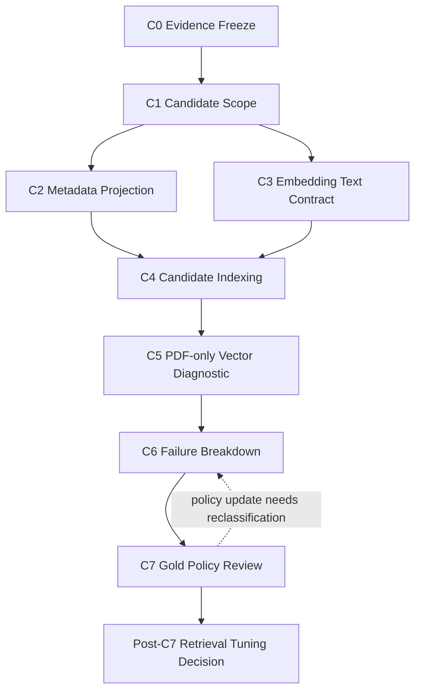

# Track C Phase Map

Track C는 retrieval tuning이 아니라 PDF retrieval metric을 해석할 수 있는 상태를 만드는 준비 트랙이다. 순서는 metadata와 indexing 신뢰도를 먼저 증명하고, 그 다음에 vector diagnostic과 gold policy를 해석하는 흐름으로 고정한다.



## Gate 순서

| Gate | 선행 조건 | 실패 시 멈추는 이유 |
|---|---|---|
| C0 -> C1 | baseline hash와 PDF counter 기록 | 이후 결과가 기존 상태와 비교되지 않음 |
| C1 -> C2/C3 | PDF documentVersionIds, parser scope, block type 분포 확정 | projection과 text audit 대상이 흔들림 |
| C2 -> C4 | vector hit location reconstruction blocker 0 | indexing 후 metric 실패 원인을 오판할 수 있음 |
| C3 -> C4 | embedding/bm25/display/citation surface blocker 0 | 검색 대상 text surface 자체가 불완전함 |
| C4 -> C5 | PDF-only namespace consistency PASS | vector diagnostic이 stale 또는 mixed namespace를 볼 수 있음 |
| C5 -> C6 | PDF-only diagnostic report 생성 | failure taxonomy의 입력이 없음 |
| C6 -> C7 | UNKNOWN failure 0, query별 next_action 존재 | gold policy와 ranking 문제를 분리할 수 없음 |
| C7 -> C6 | gold/table/OCR/page policy가 바뀜 | 기존 failure breakdown이 바뀐 정책을 반영하지 못함 |
| C7 -> tuning decision | invalid/ambiguous gold policy counter 0, 필요한 C6 재분류 완료 | 평가 라벨이 불안정한 상태에서 tuning하게 됨 |

## Stop 조건

다음 상황에서는 다음 phase로 넘어가지 않는다.

- `promotion_evidence=true` report가 생성됨.
- XLSX candidate namespace나 full72 immutable baseline artifact가 변경됨.
- C4 이전에 retrieval/ranking metric 개선을 목표로 한 tuning이 시작됨.
- `allowUnscoped=true` 또는 document scope 없는 PDF indexing이 실행됨.
- native PDF와 OCR fallback이 같은 trust level로 취급됨.
- bbox 없는 document summary를 text/OCR block failure와 같은 기준으로 평가함.

## Post-C7 판단

C7이 끝난 뒤에야 retrieval/ranking 개선 여부를 판단한다. C7에서 page/table/OCR policy가 바뀌면 C6으로 돌아가 failure breakdown을 다시 분류한다. tuning 판단은 그 재분류까지 끝난 뒤 별도 트랙 또는 후속 phase로 분리한다.

```text
metadata_projection_blocker = 0
indexing_consistency_blocker = 0
gold_policy_blocker = 0
true_retrieval_ranking_failure_count > 0
```

위 조건이 만족될 때만 PDF retrieval tuning 후보를 만들 수 있다.
